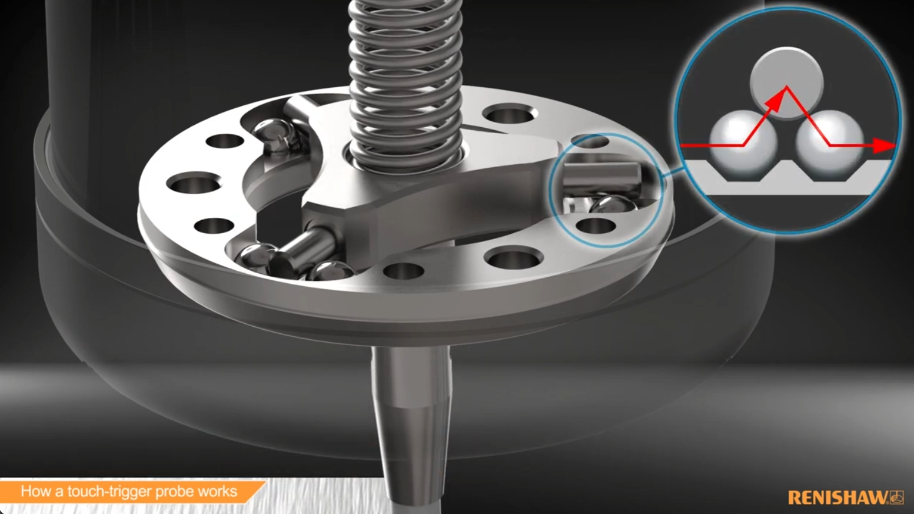
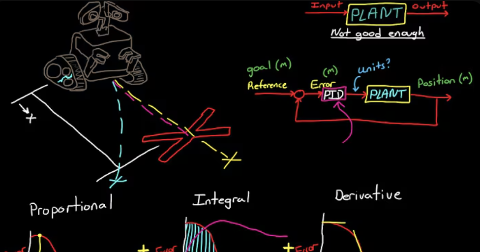

  <a href="javascript:history.back()" class="back-inline" aria-label="Back">←</a>
  <h1>Videos</h1>

---

- 
  **How a touch trigger probe works!**

- 
  **PH20 showing off**

- 
  **XL-80 simple explanation**

- 
  **PID Explained aka amplifier tuning**

