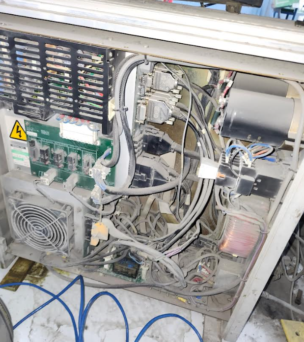
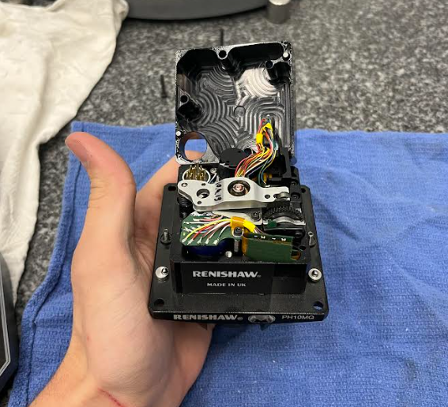
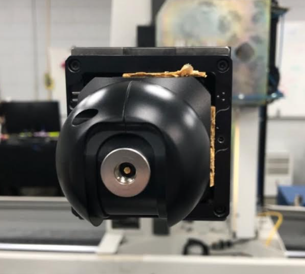

  <a href="javascript:history.back()" class="back-inline" aria-label="Back">←</a>
  <h1>Cursed</h1>

If you'd like your image added lmk!

---

**Installation and user’s guide** H-1000-5087-01-A 

**Renishaw plc T** +44 (0)1453 524524 New Mills, Wotton-under-Edge, **F** +44 (0)1453 524901 Gloucestershire, GL12 8JR **E** uk@renishaw.com United Kingdom www.renishaw.com 

## **ACR3 autochange rack system** 

**For worldwide contact details, please visit our main website at www.renishaw.com/contact** 

© 2002 Renishaw plc. All rights reserved. 

Renishaw® is a registered trademark of Renishaw plc. 

This document may not be copied or reproduced in whole or in part, or transferred to any other media or language, by any means, without the prior written permission of Renishaw. 

The publication of material within this document does not imply freedom from the patent rights of Renishaw plc. 

## **Disclaimer** 

Considerable effort has been made to ensure that the contents of this document are free from inaccuracies and omissions. However, Renishaw makes no warranties with respect to the contents of this document and specifically disclaims any implied warranties. Renishaw reserves the right to make changes to this document and to the product described herein without obligation to notify any person of such changes. 

## **Trademarks** 

All brand names and product names used in this document are trade names, service marks, trademarks, or registered trademarks of their respective owners. 

Renishaw part no:   H-1000-5087-01-A 

Issued:   12 2002 

**1** 

## **ACR3 autochange rack system** 

**Installation and user’s guide** 

**2** 

## **Care of equipment** 

Renishaw probes and associated systems are precision tools used for obtaining precise measurements and must therefore be treated with care. 

## **Changes to Renishaw products** 

Renishaw reserves the right to improve, change or modify its hardware or software without incurring any obligations to make changes to Renishaw equipment previously sold. 

## **Warranty** 

Renishaw plc warrants its equipment for a limited period (as set out in our Standard Terms and Conditions of Sale) provided that it is installed exactly as defined in associated Renishaw documentation. 

Prior consent must be obtained from Renishaw if non-Renishaw equipment (e.g. interfaces and/or cabling) is to be used or substituted. Failure to comply with this will invalidate the Renishaw warranty. 

Claims under warranty must be made from authorised Service Centres only, which may be advised by the supplier or distributor. 

## **Patents** 

Features of Renishaw’s ACR3 autochange rack system and associated equipment are the subjects of the patents and patent applications listed below: 

EP 0142373 JP 2,098,080 US 4651405 TW UM-099300 EP 0293036 JP 2,510,804 US 4813151 EP 0243766 JP 2,545,082 US 4817362 EP 0388993 JP 2,539,824 US 5,084,981 EP 0392660 JP 2,994,422 US 5,088,337 EP 0392699 JP 3,018,015 US 5,339,535 EP 0544854 JP 3,101,322 US 5,323,540 EP 0501710 JP 501,776/1994 US 5,345,689 EP 0750171 JP 503,652/1994 US 5,404,649 EP 0826136 JP 505,622/1999 US 5,505,005 EP 242747 B US 5,918,378 EP 548328 B 

**3** 

## **EC DECLARATION OF CONFORMITY** 

Renishaw plc declare that the product: - 

Name: ACR3 Description: Autochange rack Part no. A-5036-0005 

has been manufactured in conformity with the following standards: - 

BS EN 292-1:1991 Safety of machinery - Basic concepts, general BS EN 292-2:1991 principles for design: - Part 1. Basic terminology, methodology. Part 2. Technical principles and specifications. 

This product must not be put into service until the machinery into which it is to be incorporated has been declared in conformity with the provisions of the Machinery Directive - 98/37/EC. 

Signature......................................................... 7, Bs be KOS David R. Whittle Laboratory Services Supervisor Group Engineering Division Renishaw PLC 

Dated: 18[th] October 2002 

Reference no. ECD2002/17 

**4** Warnings 

## **GB** 

Pinch hazards exist between moving parts and between moving and static parts. Do not hold the probe head during movements, or during manual probe changes. 

In all applications involving the use of machine tools or CMMs, eye protection is recommended. 

Beware of unexpected movement.  The user should remain outside of the full working envelope of Probe Head/Extension/Probe combinations. 

Remove power before performing any maintenance operations. 

For instructions regarding the safe cleaning of Renishaw products, refer to the Maintenance section of the relevant product documentation. 

It is the machine supplier’s responsibility to ensure that the user is made aware of any hazards involved in operation, including those mentioned in Renishaw product documentation, and to ensure that adequate guards and safety interlocks are provided. 

Avertissements 

**5** 

## **F** 

L’effet de pincement dû au mouvement des pièces mobiles entre elles ou avec des pièces fixes présente des dangers. Ne pas tenir la tête du palpeur lorsqu’elle se déplace ou que le palpeur est changé à la main. 

Le port de lunettes de protection est recommandé pour toute application sur machine-outil et MMC. 

Attention aux mouvements brusques. L'utilisateur doit toujours rester en dehors de la zone de sécurité des installations multiples Tête de Palpeur/ Rallonge/Palpeur. 

Mettre la machine hors tension avant d'entreprendre toute opération de maintenance. 

Les conseils de nettoyage en toute sécurité des produits Renishaw figurent dans la section MAINTENANCE de votre documentation. 

Il incombe au fournisseur de la machine d’assurer que l’utilisateur prenne connaissance des dangers d’exploitation, y compris ceux décrits dans la documentation du produit Renishaw, et d’assurer que des protections et verrouillages de sûreté adéquats soient prévus. 

**6** Achtung 

## **D** 

Zwischen beweglichen und zwischen beweglichen und statischen Teilen besteht eine Einklemmgefahr. Den Meßtasterkopf nicht anfassen, wenn er sich bewegt oder wenn ein manueller Meßtasterwechsel durchgeführt wird. 

Bei der Bedienung von Werkzeugmaschinen oder Koordinatenmeßanlagen ist Augenschutz empfohlen. 

Auf unerwartete Bewegungen achten.  Der Anwender sol sich immer außerhalb des Meßtasterkopf-Arm-Meßtaster-Bereichs aufhalten. 

Bevor Wartungsarbeiten begonnen werden, muß erst die Stromversorgung getrennt werden. 

Anleitungen über die sichere Reinigung von Renishaw-Produkten sind in Kapitel MAINTENANCE (WARTUNG) in der Produktdokumentation enthalten. 

Es obliegt dem Maschinenlieferanten, den Anwender über alle Gefahren, die sich aus dem Betrieb der Ausrüstung, einschließlich der, die in der Renishaw Produktdokumentation erwähnt sind, zu unterrichten und zu versichern, daß ausreichende Sicherheitsvorrichtungen und Verriegelungen eingebaut sind. 

Avvertenze 

**7** 

## **I** 

Tra le parti in moto o tra le parti in moto e quelle ferme esiste effettivamente il pericolo di farsi del male pizzicandorsi. Evitare di afferrare la testina della sonda quando è in moto, oppure quando si effettuano spostamenti a mano. 

Si raccomanda di indossare occhiali di protezione in applicazioni che comportano macchine utensili e macchine per misurare a coordinate. 

Fare attenzione ai movimenti inaspettati.  Si raccomanda all'utente di tenersi al di fuori dell’involucro operativo della testina della sonda, prolunghe e altre varianti della sonda. 

Prima di effettuare qualsiasi intervento di manutenzione, isolare dall’alimentazione di rete. 

Per le istruzioni relative alla pulizia dei prodotti Renishaw, fare riferimento alla sezione MAINTENANCE (MANUTENZIONE) della documentazione del prodotto. 

Il fornitore della macchina ha la responsabilità di avvertire l’utente dei pericoli inerenti al funzionamento della stessa, compresi quelli riportati nelle istruzioni della Renishaw, e di mettere a disposizione i ripari di sicurezza e gli interruttori di esclusione. 

**8** Advertencias 

## **E** 

Existe el peligro de atraparse los dedos entre las distintas partes móviles y entre partes móviles e inmóviles. No sujetar la cabeza de la sonda mientras se mueve, ni durante los cambios manuales de la sonda. 

Se recomienda usar protección para los ojos en todas las aplicaciones que implican el uso de máquinas herramientas y máquinas de medición de coordenadas. 

Tener cuidado con los movimientos inesperados. El usuario debe quedarse fuera del grupo operativo completo compuesto por la cabeza de sonda/ extensión/sonda o cualquier combinación de las mismas. 

Quitar la corriente antes de emprender cualquier operación de mantenimiento. 

Para instrucciones sobre seguridad a la hora de limpiar los productos Renishaw, remitirse a la sección titulada MAINTENANCE (MANTENIMIENTO) en la documentación sobre el producto. 

Corresponde al proveedor de la máquina asegurar que el usuario esté consciente de cualquier peligro que implica el manejo de la máquina, incluyendo los que se mencionan en la documentación sobre los productos Renishaw y le corresponde también asegurarse de proporcionar dispositivos de protección y dispositivos de bloqueo de seguridad adecuados. 

Avisos **9** 

## **P** 

Figo de constrição entre peças móveis e entre peças móveis e estáticas. Não segurar a cabeça da sonda durante o movimento ou durante mudanças manuais de sonda. 

Em todas as aplicações que envolvam a utilização de máquinas-ferramenta e CMMs, recomenda-se usar protecção para os olhos. 

Tomar cuidado com movimento inesperado. O utilizador deve permanecer fora do perímetro da área de trabalho das combinações Cabeça da Sonda/ Extensão/ Sonda. 

Desligar a alimentação antes de efectuar qualquer operação de manutenção. 

Para instruções relativas à limpeza segura de produtos Renishaw, consultar a secção MAINTENANCE (MANUTENÇÃO) da documentação do produto. 

É responsabilidade do fornecedor da máquina assegurar que o utilizador é consciencializado de quaisquer perigos envolvidos na operação, incluindo os mencionados na documentação do produto Renishaw e assegurar que são fornecidos resguardos e interbloqueios de segurança adequados. 

**10** Advarsler 

## **DK** 

Der er risiko for at blive klemt mellem bevægelige dele og mellem bevægelige og statiske dele. Hold ikke sondehovedet under bevægelse eller under manuelle sondeskift. 

I alle tilfælde, hvor der anvendes værktøjs- og koordinatmålemaskiner, anbefales det at bære øjenbeskyttelse. 

Pas på uventede bevægelser. Brugeren bør holde sig uden for hele sondehovedets/forlængerens/sondens arbejdsområde. 

Afbryd strømforsyningen, før der foretages vedligeholdelse. 

Se afsnittet MAINTENANCE (VEDLIGEHOLDELSE) i produktdokumentationen for at få instruktioner til sikker rengøring af Renishawprodukter. 

Det er maskinleverandørens ansvar at sikre, at brugeren er bekendt med eventuelle risici i forbindelse med driften, herunder de risici, som er nævnt i Renishaws produktdokumentation, og at sikre, at der er tilstrækkelig afskærmning og sikkerhedsblokeringer. 

Waarschuwingen 

**11** 

## **NL** 

Er is risico op klemmen tussen de bewegende onderdelen onderling en tussen bewegende en niet-bewegende onderdelen. De sondekop tijdens beweging of tijdens manuele sondeveranderingen niet vasthouden. 

Het dragen van oogbescherming wordt tijdens gebruik van machinewerktuigen en CMM’s aanbevolen. 

Oppassen voor onverwachte beweging. De gebruiker dient buiten het werkende signaalveld van de Sondekop/Extensie/Sonde combinaties te blijven. 

Voordat u enig onderhoud verricht dient u de stroom uit te schakelen. 

Voor het veilig reinigen van Renishaw produkten wordt verwezen naar het hoofdstuk MAINTENANCE (ONDERHOUD) in de produktendocumentatie. 

De leverancier van de machine is ervoor verantwoordelijk dat de gebruiker op de hoogte wordt gesteld van de risico’s die verbonden zijn aan bediening, waaronder de risico’s die vermeld worden in de 

produktendocumentatie van Renishaw. De leverancier dient er tevens voor te zorgen dat de gebruiker is voorzien van voldoende beveiligingen en veiligheidsgrendelinrichtingen. 

**12** Varning 

## **SW** 

Risk för klämning existerar mellan rörliga delar och mellan rörliga och stillastående delar. Håll ej i sondens huvud under rörelse eller under manuella sondbyten. 

Ögonskydd rekommenderas för alla tillämpningar som involverar bruket av maskinverktyg och CMM. 

Se upp för plötsliga rörelser. Användaren bör befinna sig utanför arbetsområdet för sondhuvudet/förlängningen/sond-kombinationerna. 

Koppla bort strömmen innan underhåll utförs. 

För instruktioner angående säker rengöring av Renishaws produkter, se avsnittet MAINTENANCE (UNDERHÅLL) i produktdokumentationen. 

Maskinleverantören ansvarar för att användaren informeras om de risker som drift innebär, inklusive de som nämns i Renishaws produktdokumentation, samt att tillräckligt goda skydd och säkerhetsförreglingar tillhandahålls. 

Varoituksia **13** 

## **FIN** 

Liikkuvien osien sekä liikkuvien ja staattisten osien välillä on olemassa puristusvaara. Älä pidä kiinni anturin päästä sen liikkuessa tai vaihtaessasi anturia käsin. 

Kaikkia työstökoneita ja koordinoituja mittauskoneita (CMM) käytettäessä suositamme silmäsuojuksia. 

Varo äkillistä liikettä.  Käyttäjän tulee pysytellä täysin anturin pään/jatkeen/ anturin yhdistelmiä suojaavan toimivan kotelon ulkopuolella. 

Kytke pois sähköverkosta ennen huoltotoimenpiteitä. 

Renishaw-tuotteiden turvalliset puhdistusohjeet löytyvät tuoteselosteen MAINTENANCE (HUOLTOA) koskevasta osasta. 

Koneen toimittaja on velvollinen selittämään käyttäjälle mahdolliset käyttöön liittyvät vaarat, mukaan lukien Renishaw’n tuoteselosteessa mainitut vaarat. Toimittajan tulee myös varmistaa, että toimitus sisältää riittävän määrän suojia ja lukkoja. 

**14** 

Contents 

**15** 

## **Contents** 

|1|Introduction..............................................................................................................17|Introduction..............................................................................................................17|
|---|---|---|
|2|System description ..................................................................................................19||
||2.1|General description ......................................................................................19|
||2.2|ACR3 autochange rack ................................................................................21|
||2.3|Modular rack stand (MRS) ...........................................................................22|
||2.4|Compatible Renishaw products ...................................................................22|
|||2.4.1 Heads..................................................................................................22|
|||2.4.2 Probes.................................................................................................22|
|3|Head alignment .......................................................................................................25||
||3.1|Alignment of the probe head - roll................................................................26|
||3.2|Alignment of the probe head - pitch .............................................................27|
||3.3|Alignment of the probe head - yaw ..............................................................29|
||3.4|AM1 adjustable module ...............................................................................31|
|||3.4.1 Adjusting the AM1 ...............................................................................31|
||3.5|AM2 adjustment module ..............................................................................33|
|||3.5.1 Adjusting the AM2 ...............................................................................34|
|4|Fitting|the ACR3 to the MRS rack ...........................................................................35|
||4.1|Fitting a four port ACR3 system ...................................................................35|
||4.2|Fitting an eight port ACR3 system ...............................................................38|
|5|Datuming the ACR3 ................................................................................................41||
||5.1|Locating the z position of the ACR3 ............................................................41|
||5.2|Locating the y position of the ACR3 ............................................................44|
||5.3|Locating the x position of the ACR3 ............................................................45|
|6|ACR3|change routine ..............................................................................................57|
||6.1|Load routine .................................................................................................57|
||6.2|Unload routine .............................................................................................58|
|7|Troubleshooting .......................................................................................................59||

**16** Contents 

|8|Accessories / spare parts ........................................................................................61|
|---|---|
|9|Maintenance ............................................................................................................63|
||9.1 Port replacement..........................................................................................63|
||9.2 Cleaning .......................................................................................................64|
|10|System dimensions .................................................................................................65|
||10.1 4 port system ...............................................................................................65|
||10.2 8 port system ...............................................................................................66|

Introduction 

**17** 

## **1 Introduction** 

This guide contains information relating to the installation and operation of Renishaw’s ACR3 (autochange rack) system (figure 1). 

This guide takes a step by step approach to fitting, aligning and datuming the rack as well as providing operational and troubleshooting guidance. 

System integration and software routines recommended for the successful implementation of the ACR3 are also provided. 

**==> picture [322 x 270] intentionally omitted <==**

**Figure 1 - ACR3** 

**18** Introduction 

INTENTIONALLY, THIS PAGE HAS BEEN LEFT BLANK 

System description 

**19** 

## **2 System description** 

## **2.1 General description** 

Renishaw’s ACR3 is a four port rack that facilitates fast, automatic probe exchange without the need for probe re-qualification.  In addition, the ACR3 provides covered storage and protection for up to eight probes and extension bars (two four port systems can be linked to provide an eight port system). 

Mounted within the CMM’s working envelope, the ACR3 is combined with the modular rack system (MRS) to form an automatic change rack for probes and extension bars that incorporate the Renishaw autojoint. 

The autojoint (as shown in figure 2) is a highly repeatable kinematic joint, one half of which is attached to the probe head, the other half to a probe, extension bar or adapter. 

**==> picture [298 x 270] intentionally omitted <==**

**----- Start of picture text -----** 
Head or extension bar Clamping mechanism Kinematic location Locking / unlocking screw Electrical contacts PAA1 adaptor **----- End of picture text -----** 

**Figure 2 - Autojoint** 

**20** System description 

Locking and unlocking of the autojoint is achieved either manually, using an autojoint key, or automatically, using the autochange rack system. In all cases, the repeatability of the autojoint eliminates the need for probe requalification after each probe exchange. 

Fast probe exchange cycles are achieved by the probe head docking the original probe and selecting a new one. The autochange system consists of a four port autochange rack (ACR3) and the modular rack system (MRS) as shown in figure 3 below. 

**==> picture [322 x 218] intentionally omitted <==**

**Figure 3 - MRS and ACR3** 

System description 

**21** 

## **2.2 ACR3 autochange rack** 

The ACR3 (see figure 4) is a four port mechanical design that traverses the MRS rail.  Driven by the motion of the CMM, it locks and unlocks the autojoint between the probe and the probe head. 

## **Figure 4 - ACR3** 

Each rack port (figure 5) is of modular design to permit easy replacement should wear occur during the operational life of the ACR3. 

Each rack comes with a setting gauge (figure 6) that is designed to assist in the datuming of the ACR3. 

**Figure 5 - Rack port** 

**Figure 6 - Setting gauge** 

**22** System description 

## **2.3 Modular rack stand (MRS)** 

The MRS is the common mounting platform for the ACR3, SCP600 (stylus change port for SP600) and FCR25 (flexible change rack for SP25M). It is available in a number of different overall lengths and heights. For a detailed explanation of this system, please refer to the MRS installation and user’s guide (part no. H-1000-5088). 

## **2.4 Compatible Renishaw products** 

Renishaw have a number of probe heads and probes that have either the male or female part of the autojoint fitted to them. Listed below is a brief description of each. For additional information, please refer to the relevant product documentation. 

## **2.4.1 Heads** 

**PH10M** – A motorised indexing probe head with 720 repeatable positions suitable for all two wire and multiwired probes. 

**PH10MQ** – This is an in-quill mounted version of the PH10M head. 

**PH6M** – A fixed autojointed probe head suitable for all two wire and multiwired probes. 

## **2.4.2 Probes** 

**SP25** – High accuracy scanning probe enabling the user to scan for form measurement and reverse engineering, rapid TTP for geometric measurements is also possible. 

**SP600M** – Analogue contact scanning probe which is ideal for profile scanning and it features 300 mm stylus capability. Permits the CMM to gather large amounts of data very rapidly. 

**TP7M** – High accuracy strain gauge based touch-trigger probe. 

**TP6A** – This is a probe suited to general purpose probing applications offering longer and heavier styli carrying capability. 

**OTP6M** – An optical trigger probe that uses a visible laser spot to provide a non-contact inspection solution for CMMs. 

System description 

**23** 

Using the Renishaw range of probe adaptor bars (PAA), the complete range of Renishaw M8 probes can be used in conjunction with the autochange system; a brief description of some of these probes is given below: 

**TP20** – A 13 mm diameter kinematic touch-trigger probe consisting of a two piece design that provides the facility to repeatedly change probe modules without the need for re-qualification. 

**TP200** – A 13 mm diameter strain gauge based touch-trigger probe consisting of a two piece design that provides the facility to repeatedly change stylus modules without the need for re-qualification. 

**TP2** - A 13 mm diameter kinematic touch-trigger probe with adjustable stylus force. 

**TP6** – A 25 mm diameter kinematic touch-trigger probe of a robust design. 

**NOTE 1:** ACR3 can only be used in the horizonal orientation. 

**NOTE 2:** It is not possible to remove probes off the end of extension bars using ACR3. 

System description 

**24** 

INTENTIONALLY, THIS PAGE HAS BEEN LEFT  BLANK 

Head alignment 

**25** 

## **3 Head alignment** 

It is necessary for the probe head to be aligned with both the movements of the CMM and the ACR3. This is because the autojoint is a high force mechanical joint that could cause operational errors if used with an incorrectly aligned ACR3. 

**NOTE:** The Renishaw PH10 motorised head system has been designed so that the roll and pitch of the autojoint is held within the tolerances required for the ACR3 system, when connected to a standard Renishaw shank. 

In the majority of installations only the yaw of the motorised head requires alignment. However, it is possible that the location of the probe head shank to the CMM quill, or the mounting face of the PH10MQ to the CMM quill, is not held to the required tolerances. In some cases, this could result in excessive ACR3 port wear or failure of the ACR3 to change probes. 

This problem can be rectified by using either the AM1 or AM2 adjustment module. 

**26** Head alignment 

## **3.1 Alignment of the probe head - roll** 

The roll axis of the head is from the left-hand side to the right-hand side of the probe head. **The maximum recommended alignment error is 0.2°.** 

The recommended procedure for setting the roll of a motorised or indexing probe head is as follows (see figure 7): 

**NOTE:** During this procedure the probe should not be qualified. 

1. Index the probe head to an A axis position of 90° and a B axis position of -90°. 

2. Using the probe attached to the probe head, measure the qualification sphere on the CMM table (sphere 1).  Use the centre of this measured sphere as a datum. 

3. Index the probe head to an A axis position of 90° and a B axis position of 90°. 

4. Using the probe attached to the probe head, measure the qualification sphere on the CMM table (sphere 2). 

5. Calculate the roll angle for the probe head using the following formula: 

Z asix pooitisn of sphere 2 = Rllo anelg arc TAN Y asix pooitisn of sphere 2 r(ecommended <0.2)° { } 

6. If the roll angle exceeds 0.2° then adjustment is required, please refer to ‘Adjusting the AM1’ or ‘Adjusting the AM2’ as appropriate and repeat steps 1 to 5. 

Head alignment **27** 

**==> picture [321 x 188] intentionally omitted <==**

**Figure 7 - Probe head in two positions measuring qualification sphere (roll angle)** 

## **3.2 Alignment of probe head – pitch** 

The pitch axis of the head is from the front of the probe head (where the LED is located) to the rear of the probe head. **The maximum recommended alignment error is 0.2°.** 

The recommended procedure for setting the pitch of a motorised or indexing probe head is as follows (see figure 8): 

**NOTE:** During this procedure the probe should not be qualified. 

1. Index the probe head to an A axis position of 90° and a B axis position of 0°. 

2. Using the probe attached to the probe head, measure the qualification sphere on the CMM table (sphere 1). Use the centre of this measured sphere as a datum. 

3. Index the probe head to an A axis position of 90° and a B axis position of 180°. 

**28** Head alignment 

4. Using the probe attached to the probe head, measure the qualification sphere on the CMM table (sphere 2). 

5. Calculate the pitch angle for the probe head using the following formula: 

Z asix pooitisn of sphere 2 = Pctih anelg arc TAN X asix pooitisn of sphere 2 r(ecommended <0.2)° { } 

6. If the roll angle exceeds 0.2° then adjustment is required, please refer to ‘Adjusting the AM1’ or ‘Adjusting the AM2’ as appropriate and repeat steps 1 to 5. 

**==> picture [163 x 210] intentionally omitted <==**

**==> picture [101 x 117] intentionally omitted <==**

**Figure 8 - Probe head in two positions measuring qualification sphere (pitch angle)** 

**29** 

Head alignment 

## **3.3 Alignment of the probe head - yaw** 

The yaw axis of the head is the rotational axis of the probe head with respect to the quill of the CMM. **The maximum recommended alignment error is 0.2°.** 

The recommended procedure for setting the yaw of a motorised or indexing head is as follows (see figure 9): 

**NOTE:** During the procedure the probe should not be qualified. 

1. Index the probe head to an A axis position of 0° and a B axis position required for an autojoint probe to enter the ACR3. 

2. Using the probe attached to the probe head, measure the qualification sphere on the CMM table (sphere 1).  Use the centre of the measured sphere as a datum. 

3. Index the probe head to an A axis position of 90°, maintaining the same B axis position as in step 1. 

4. Using the probe attached to the probe head, measure the qualification sphere on the CMM table (sphere 2). 

5. Calculate the yaw angle of the probe head using the following formula: 

X asix pooitisn of sphere 2 = Yaw anelg arc TAN Y asix pooitisn of sphere 2 r(ecommended <0.2)° { } 

6. If the yaw angle exceeds 0.2° then adjustment is required, please refer to ‘Adjusting the AM1’ or ‘Adjusting the AM2’ as appropriate and repeat steps 1 to 5. 

Head alignment 

**30** 

**==> picture [145 x 189] intentionally omitted <==**

**Figure 9 - Probe head in two positions measuring qualification sphere (yaw angle)** 

Head alignment **31** 

## **3.4 AM1 adjustable module** 

The AM1 adjustment module (see figure 10) is designed to provide quick and accurate angular alignment of the PH6M and PH10M with the axes of the CMM and Renishaw ACR3. 

In addition, the quick release mechanism allows the probe heads to be removed for storage and replaced without further alignment. In-built overtravel protection minimises the risk of probe head damage. 

## **3.4.1 Adjusting the AM1** 

Listed below are instructions to adjust the AM1 to align the probe head to the CMM axes. The procedure should be carried out in the order specified: 

**1. Roll adjustment** - rotate the roll adjusting capstans equally and in opposite directions (i.e. rotate one capstan clockwise and the other anti-clockwise) to adjust roll. 

**2. Pitch adjustment** - rotate the pitch adjusting capstan to increase or decrease the pitch. 

**3. Yaw adjustment** - 

   - a. Release the lock screw. 

   - b. Rotate the yaw adjusting screws equally in opposite directions to provide the required yaw. 

   - c. Tighten the screws against each other without applying excessive torque. 

   - d. Tighten the lock screw. 

Head alignment 

**32** 

4. Quick release of the AM1 from shank - 

   - a. Release the lock screw. 

   - b. Retract ONE yaw adjustment screw. 

**NOTE:** If repeatability of position is required on re-attachment, DO NOT alter the other screw. This repeatability of position is normally sufficient for alignment with the autochange rack, but probes must be re-qualified for measurement. 

5. Re-attachment of AM1 to shank 

   - a. Locate the AM1 against the shank and rotate until engaged. 

   - b. Tighten the yaw adjustment screw. 

   - c. Tighten the locking screw. 

**==> picture [278 x 169] intentionally omitted <==**

**----- Start of picture text -----** 
Pitch adjusting capstan Safety screw Yaw adjusting Yaw adjusting screw screw Roll adjusting Roll adjusting capstan Locking capstan screw **----- End of picture text -----** 

**Figure 10 - AM1 adjustment module** 

**33** 

Head alignment 

## **3.5 AM2 adjustment module** 

The AM2 adjustment module (see figure 11) is designed to provide quick and accurate angular alignment of the PH10MQ motorised probe head with the axes of the CMM and Renishaw ACR3. 

The AM2 consists of the adjuster plate, which is attached to the quill of the CMM, and a set of adjusters fitted to the flange of the head. 

The probe head is fixed to the adjuster plate by a pair of captive screws. 

The AM2 incorporates a quick release mechanism that allows the same probe head to be removed for storage and refitted without further alignment. 

**NOTE:** If repeatability of position is required on re-attachment, only the securing screws should be released.  Do not alter the other screws.  This repeatability of position is normally sufficient for alignment with the autochange rack, but probes must be requalified for measurement. 

**==> picture [312 x 172] intentionally omitted <==**

**----- Start of picture text -----** 
80 mm square 70.5 mm square [>| Yaw adjustment screw Roll adjustment screw Securing screw */©Teall Securing screw a © AM2 to quill NwmS mounting screws Pitch adjustment screw **----- End of picture text -----** 

**Figure 11 - AM2 adjustment module** 

**34** Head alignment 

## **3.5.1 Adjusting the AM2** 

A special tool is supplied, consisting of a concentric hexagon key and socket spanner. This should be located on the adjusters and locknuts recessed into the face of the head mounting flange. 

**NOTE:** Springs are fitted under the adjuster locknuts to provide some preload during set up. 

The procedure to use this tool is: 

1. Slacken the locknut slightly using the outer part of the tool. 

2. Set the adjuster using the inner part of the tool. 

3. While holding the adjuster stationary with the inner part of the tool, tighten the locknut using the outer part of the tool: 

**Roll adjustment:** Using the AM2 tool and the procedure given above, adjust the roll adjustment screw on the AM2 (as shown in figure 11). 

**Pitch adjustment:** Using the AM2 tool and the procedure given above, adjust the pitch adjustment screw on the AM2 (as shown in figure11). 

**Yaw adjustment:** Using the AM2 tool and the procedure given above, adjust the yaw adjustment screw on the AM2 (as shown in figure 11). 

4. Tighten the two securing screws (as shown in figure 11). 

**NOTE:** Tightening the securing screws could cause the roll, pitch or yaw alignment to change. It is therefore recommended that the alignments are checked after this procedure. 

Fitting the ACR3 to the MRS rack 

**35** 

## **4 Fitting the ACR3 to the MRS rack** 

## **4.1 Fitting a four port ACR3 system** 

It is recommended that the ACR3 rack be attached to the MRS rack using the following procedure. During this procedure, it is assumed that the MRS rack has been installed as detailed in the MRS installation guide (H-1000-5088): 

A **!** 

**CAUTION:** Moving parts, beware of pinch hazards.  The MRS must be securely bolted to the machine table. 

1. With the ARC3 in fully **unlocked** position; place bolt through the righthand countersunk clearance hole, into thread of the long 'T' nut and finger tighten. 

**NOTE:** Ensure T-nuts are positioned as indicated in Figure 12. 

**==> picture [274 x 206] intentionally omitted <==**

**----- Start of picture text -----** 
UNLOCKED 'T' nuts LOCKED =e Countersunk positioning hole < a Bolt **----- End of picture text -----** 

**Figure 12 - ACR3 fully unlocked position** 

Fitting the ACR3 to the MRS rack 

**36** 

2. With the ACR3 in fully **locked** position: 

**==> picture [277 x 181] intentionally omitted <==**

**----- Start of picture text -----** 
UNLOCKED 'T' nuts LOCKED Countersunk positioning hole Bolt **----- End of picture text -----** 

**Figure 13 - ARC3 fully locked position** 

Place bolt through the left-hand countersunk clearance hole, into the thread of the short 'T' nut and finger tighten. 

3. Position the ACR3 on the MRS rack such that the rack can move freely from its unlocked position to its locked position. 

4. Using the 5 mm hex key (supplied), tighten the two countersunk bolts. 

5. Check the alignment of the ACR3 with respect to the CMM axis. This is achieved by taking two points on the front of the ACR3 as shown in figure 14. The ‘run out’ of the ACR3, with respect to the CMM axis, should be less than 0.5 mm between these two points. 

6. Adjustment of the ACR3 (with respect to the machine axis) should be completed by releasing the appropriate countersunk bolt and manually re-positioning the ACR3 and then re-tightening the bolt. 

Fitting the ACR3 to the MRS rack 

**37** 

**Figure 14 - Alignment of the ACR3** 

**CAUTION:** Ensure rack does not overhang the MRS in either the A **!** locked or unlocked position. 

**NOTE:** The springs supplied can be inserted into the short 'T' nut and used to maintain the position of the 'T' nut in the MRS rail.  See figure 15. 

**Figure 15 - Use of springs** 

Fitting the ACR3 to the MRS rack 

**38** 

## **4.2 Fitting an eight port ACR3 system** 

The long 'T' nut is designed to allow two 4 port units to be linked, as shown by figure 16.  The distance required between the two racks is ‘set’ by the 'T' nut.  For attaching an 8 port system follow the instructions in section 4.1 to fit ACR3 ports 1 - 4. **However, ensure the 'T' nuts are as indicated in figure 16.** To fit ports 5 - 8 follow the instructions below: 

**==> picture [24 x 22] intentionally omitted <==**

**----- Start of picture text -----** 
A ! **----- End of picture text -----** 

**CAUTION:** Moving parts, beware of pinch hazards.  The MRS must be securely bolted to the machine table. 

1. Mount one ACR3 as detailed in 4.1 taking care to re-orientate the long 'T' nut. 

2. Slide ACR3 to the fully unlocked position (left-hand side of travel). Push ACR3 ports 5 - 8 into the fully locked position (right-hand side of travel).  Pass the bolt through the left hand countersunk clearance hole.  Finger tighten. 

**==> picture [35 x 21] intentionally omitted <==**

**----- Start of picture text -----** 
Mounting plate **----- End of picture text -----** 

**Figure 16 - 'T' nuts for 8 port ACR3** 

**CAUTION:** Ensure rack does not overhang the MRS in either the locked or unlocked position. 

A **!** 

Fitting the ACR3 to the MRS rack 

**39** 

4. Push the ACR3 ports 5 - 8 into the fully unlocked position to the left. Place bolt through the right-hand countersunk clearance hole into short 'T' nut and finger tighten, as in figure 17. 

**NOTE:** The long 'T' nut **must** be used when linking two ACR3s. 

**Figure 17 - Attaching the 8 port ACR3** 

4. Position the ACR3 on the MRS so that the rack can move freely from its unlocked position to its locked position. 

5. Using the 5 mm hex key (supplied), tighten the four countersunk bolts. 

6. Using the connection bolt and O-ring supplied with the ACR3 kit, join the two ACR3 units as shown in figure 18. Use the O-ring supplied to separate the two racks. 

7. Check the alignment of each of the ACR3’s with respect to the CMM axis. This is achieved by taking two points on the front of each ACR3 unit as shown in figure 14. The ‘run out’ of each of the ACR3 units, with respect to the CMM axis, should be less than 0.5 mm, between the points on each rack. 

8. Adjustment of the ACR3’s (with respect to the machine axis) should be completed by releasing the necessary mounting bolt, manually repositioning the ACR3 and then re-tightening the bolt. 

**40** Fitting the ACR3 to the MRS rack 

**==> picture [29 x 10] intentionally omitted <==**

**----- Start of picture text -----** 
‘O’ ring **----- End of picture text -----** 

**Figure 18 - ACR3 showing mounting nuts (MRS rail removed for clarity)** 

Datuming the ACR3 

**41** 

## **5 Datuming the ACR3** 

The following section describes the recommended procedure for datuming the ACR3 once it is fitted to the MRS rack and the MRS is fitted to the CMM table (please refer to ‘Fitting the ACR3 to the MRS rack’, earlier in this document). 

## **5.1 Locating the z position of the ACR3** 

1. Position the ACR3 so that it is in the unlocked position (positioned to the left-hand side of the travel). 

2. Insert the lid clips as shown in figure 19. 

**Figure 19 - Inserting the lid clips on the ACR3** 

**NOTE:** This procedure assumes the rack is aligned with the Y axis.  If the rack is aligned with the X axis, transpose X and Y. 

Datuming the ACR3 

**42** 

3. Position the ACR3 setting gauge into port 1 as shown in figure 20. 

4. Inhibit the probe signal.  It is recommended that this is done from within the CMM software. 

A **! Use extreme caution:** The machine could be crashed. 

5. Remove the probe from the probe head (at the autojoint). a San a Setting ~~a~~ gauge 

**==> picture [202 x 10] intentionally omitted <==**

**----- Start of picture text -----** 
Figure 20 - Positioning the ACR3 setting gauge **----- End of picture text -----** 

**Figure 21 - Locating the z  position of the ACR3** 

Datuming the ACR3 

**43** 

6. Position the autojoint puller into the central slot of the ACR3 setting piece. Take care not to move the position of the ACR3 (see figure 21). 

7. Using ~50 µm DCC incremental moves, slowly lower the autojoint face so that it just touches (machine Z axis) onto the top face of the setting gauge.  Use it as a feeler gauge to identify the correct Z axis position for the probe head with respect to the ACR3. Record a point at this position (point A). 

**NOTE:** More than one attempt may be required to get a ‘feel’ for this operation. 

**==> picture [24 x 22] intentionally omitted <==**

**----- Start of picture text -----** 
! **----- End of picture text -----** 

**LIVE CMM AXES:** REMAIN OUTSIDE WORKING ZONE BETWEEN Z POSITION CHECKS.  DO NOT ALLOW OTHERS TO OPERATE THE CMM DURING THIS PROCESS. 

8. Remove the probe head from the ACR3 setting piece. 

**==> picture [24 x 22] intentionally omitted <==**

**----- Start of picture text -----** 
! **----- End of picture text -----** 

It is not possible to use the probe to find the ‘Z’ position because of tolerance stackups within the probe and stylus combination. 

**44** Datuming the ACR3 

## **5.2 Locating the x position of the ACR3** 

1. Move the probe head so that the external surface of the autojoint is just touching the front of the ACR3 setting piece (see figure 22). Use ~50 µm DCC incremental moves, to identify the correct Y axis position. 

2. Record a point at this position (point B). 

3. Move the probe head clear of the ACR3 and connect the probe assembly. 

**NOTE:** Ensure that the autojoint locking cam is positioned approximately 5° backed off from the fully locked position and enable the probe signal. 

4. Remove the ACR3 setting piece from port 1. 

**==> picture [276 x 159] intentionally omitted <==**

**----- Start of picture text -----** 
ACR3 port Probe  head autojoint ACR3 setting gauge **----- End of picture text -----** 

**Figure 22 - Locating the x position of the ACR3** 

Datuming the ACR3 

**45** 

## **5.3 Locating the y position of the ACR3** 

1. Manually take 4 points on the top of port 1 (port[1] unlocked, points 1 to 4) as shown in figure 23, to create a plane. 

**==> picture [101 x 52] intentionally omitted <==**

**----- Start of picture text -----** 
2 3 1 —— 4 **----- End of picture text -----** 

**Figure 23 - Taking points on port top** 

**NOTE:** Take care not to take a point to close to the lid clip as this may cause a problem later on in the datuming procedure. 

2. Manually take 4 points round the curved part at the rear of port 1 (port[1] unlocked, circle centre) as shown in figure 24.  Take care to avoid the driver blade and the mounting screw holes. 

**==> picture [103 x 69] intentionally omitted <==**

**----- Start of picture text -----** 
1 2 3 Vie 4 **----- End of picture text -----** 

**Figure 24 - Taking points inside port** 

Datuming the ACR3 

**46** 

3. Construct an axis system using: 

   - “Port1 unlocked, points 1 to 4” as the primary plane (refer to step 1). 

   - “Port1 unlocked, circle centre” as the secondary axis and tertiary axis origin (refer to step 2). 

   - Store this axis system as (axis 1). 

4. The CMM can now locate ports 2 to 4 in the unlocked position under CNC control. The table below shows the nominal location of the centre of these ports, assuming that the rack is running along the CMM’s Y axis. 

|tr o P|n oitis o p X|n oitis o p Y|
|---|---|---|
|1|0|0|
|2|0|5 3|
|3|0|0 7|
|4|0|5 0 1|

Dimenoisns ni mm 

The recommended procedure for locating the ports is as follows (see figures 21 and 22 for reference): 

- a. Move stylus to nominal XY centre of port. 

- b. Move stylus to 2 mm below the top surface of the port, in the current axis (axis 1) system. 

- c. Take 4 points round the curved part at the rear of the port. 

- d. Use the 4 points to create a circle, use this as a sub-datum in the XY axis. 

Datuming the ACR3 

**47** 

e. Take 4 points on the top surface of the port. 

|t nio P|n oitis o p X|n oitis o p Y|
|---|---|---|
|1|8|5 . 3 1 -|
|2|8 -|5 . 3 1 -|
|3|8 -|5 . 3 1|
|4|8|5 . 3 1|

      - Dimenoisns ni mm 

   - f. Store the points as port[x] unlocked points 1 to 4. 

   - g. Store the circle as port[x] unlocked circle 1. 

   - h. Recall axis 1 (see step 3). 

   - i. Locate the next port. 

6. If an eight port ACR3 is to be fitted to the CMM then step 7 should be completed, otherwise please go to step 8. 

7. The CMM can now locate ports 5 to 8 in the unlocked position under CNC control.  The table below shows the nominal location of the centre of these ports, with respect to the axis 1, assuming that the rack is running along the CMM’s Y axis. 

|tr o P|n oitis o p X|n oitis o p Y|
|---|---|---|
|5|0|7 8 1|
|6|0|2 2 2|
|7|0|7 5 2|
|8|0|2 9 2|
|m m ni s n ois n e m i D|||

x  Port number (e.g. 1, 2, 3 etc.). 

**48** Datuming the ACR3 

The recommended procedure for locating 5 to 8 ports is as follows (see figures 23 and 24 for reference): 

- a. Take a Z axis reference point (x = 6.5 mm, y = 173.8 mm) for ACR3 in the unlocked position. Use this point as a Z axis sub datum for locating ports 5 through 8 in the unlocked position. 

- b. Move stylus to nominal XY centre of port. 

- c. Move stylus to 2 mm below the top surface of the port, in the current axis (axis 1) system. 

- d. Take 4 points round the curved part at the rear of the port. 

- e. Use the 4 points to create a circle, use this as a sub-datum in the XY axis. 

- f. Take 4 points on the top surface of the port. 

|t nio P|n oitis o p X|n oitis o p Y|
|---|---|---|
|1|8|5 . 3 1 -|
|2|8 -|5 . 3 1 -|
|3|8 -|5 . 3 1|
|4|8|5 . 3 1|

      - Dimenoisns ni mm 

   - g. Store the points as port[x] unlocked points 1 to 4. 

   - h. Store the circle as port[x] unlocked circle 1. 

   - i. Recall axis 1. (see step 3). 

   - j. Locate the next port. 

8. Move the probe head clear of the ACR3. 

9. Move the ACR3 to the locked position (positioned to the right-hand side of the travel). 

x  Port number (e.g. 5, 6, 7 etc.). 

Datuming the ACR3 

**49** 

10. Take a Z axis reference point (x = 6.5 mm, y = 75.5 mm) for ACR3 position in the locked position. Use this point as a Z axis sub datum for locating ports 1 through 4 in the locked position. 

11. The CMM can now locate ports 1 to 4 in the locked position under CNC control. The table below shows the nominal location of the centre of these ports. 

|t nio P|n oitis o p X|n oitis o p Y|
|---|---|---|
|1|0|6 9 . 8 8|
|2|0|6 9 . 3 2 1|
|3|0|6 9 . 8 5 1|
|4|0|6 9 . 3 9 1|

Dimenoisns ni mm 

Recommended procedure for locating port: 

- a. Move stylus to nominal XY centre of port. 

- b. Move stylus to 2 mm below the top surface of the port, in the current axis. 

- c. Take 4 points round the curved part at the rear of the port. 

- d. Use the 4 points to create a circle, use this as a sub-datum in the XY axis. 

Take 4 points on the top surface of the port 

|t nio P|n oitis o p X|n oitis o p Y|
|---|---|---|
|1|8|5 . 3 1 -|
|2|8 -|5 . 3 1 -|
|3|8 -|5 . 3 1|
|4|8|5 . 3 1|
|m m ni s n ois n e m i D|||

**50** Datuming the ACR3 

   - a. Store the points as port[x] locked points 1 to 4. 

   - b. Store the circle as port[x ] locked circle 1. 

   - c. Recall axis 1 (see step 3). 

   - d. Apply Z axis reference point as a Z axis sub-datum (see step 10). 

   - e. Locate the next port. 

12. If an eight port ACR3 is to be fitted to the CMM then this step should be completed, otherwise please go to step 14. 

13. The CMM can now locate ports 5 to 8 in the locked position under CNC control. The table below shows the nominal location of the centre of these ports, with respect to axis 1, assuming that the rack is running along the CMM’s Y axis. 

|t nio P|n oitis o p X|n oitis o p Y|
|---|---|---|
|5|0|6 9 . 5 7 2|
|6|0|6 9 . 0 1 3|
|7|0|6 9 . 5 4 3|
|8|0|6 9 . 0 8 3|

- Dimenoisns ni mm 

Recommended procedure for locating port (see figure 22 and 23 for reference): 

- a. Take a Z axis reference point (x = 6.5 mm, y = 262.3 mm) for ACR3 in the unlocked position. Use this point as a Z axis sub datum for locating ports 5 to 8 in the unlocked position. 

- b. Move stylus to nominal XY centre of port. 

- c. Move stylus to 2 mm below the top surface of the port, in the current axis (axis 1) system. 

Datuming the ACR3 **51** 

- a. Take 4 points round the curved part at the rear of the port. 

- b. Use the 4 points to create a circle, use this as a sub-datum in the XY axis. 

- c. Take 4 points on the top surface of the port. 

|t nio P|n oitis o p X|n oitis o p Y|
|---|---|---|
|1|8|5 . 3 1 -|
|2|8 -|5 . 3 1 -|
|3|8 -|5 . 3 1|
|4|8|5 . 3 1|

Dimenoisns ni mm 

- a. Store the points as port[x] locked points 1 to 4. 

- b. Store the circle as port[x ] locked circle 1. 

- c. Recall axis 1. (see step 3). 

- d. Locate the next port. 

**NOTE:** As the movement of the ACR3 may not be a single axis move, the following procedure utilises dedicated axis systems for each port. 

Datuming the ACR3 

**52** 

14. An axis system is now constructed for each of the ports. This step shows the construction steps for port 1 and should be repeated for each port: 

   - a. Construct a plane from port[1] unlocked points 1 to 4 and port[1] locked points 1 to 4 (port plane). 

   - b. Construct a line from port[1] unlocked circle 1 and port[1] locked circle 1 (port line). 

   - c. Construct an axis system (port[1] axis) using: 

      - Port plane as the primary axis 

      - Port line as the secondary axis 

      - Port[1 ] unlocked circle 1 as the tertiary axis and origin of the axis system. 

   - d. Save axis system as port[1] axis. 

   - e. Repeat this for the remaining ports. 

15. The Z axis offset now has to be calculated as follows: 

   - a. Recall port[1] axis. 

   - b. Recall Point A (see section 5.1, step 7) in this axis system. 

   - c. Use the following formula: 

## **probe Z offset = Z axis of Point A * – 1** 

Datuming the ACR3 

**53** 

16. The probe X axis offset now has to be calculated as follows: 

   - a. Recall port[1] axis. 

   - b. Recall Point B (see section 5.2, step 1) in this axis system. 

   - c. Use the following formula: 

## **probe X offset = X axis of Point B – 42 mm** 

17. Apply the Z and X probe offsets to all the ACR3 axis systems as follows, as constructed in step 14: 

   - a. Recall port[x] axis. 

   - b. Translate the Z axis datum position by probe Z offset. 

   - c. Translate the X axis datum position by probe X offset. 

   - d. Store as port[x] axis. 

18. Move the probe clear of the ACR3. 

19. Recall ACR3 axis[4] , move the probe head to a position of X 40 mm,Y 62.6 mm, Z 0 mm 

20. Move the ACR3 so that port 4 is located behind the position of the probe head. 

21. Slowly move the probe head in the X axis to a position of X = 0 mm (probe docked into the ACR3). 

Datuming the ACR3 

**54** 

22. With the head located in port 4 move along the ACR3 Y axis using 50 to 100 µm DCC moves until the alignment circle is positioned in the centre of the alignment window.  Record a point (point C) in this position (see figure 25, below, for reference). 

## **Figure 25 - Locating the y position of ACR3** 

23. The probe Y axis offset now has to be calculated> 

## **probe Y offset = Y axis position of point C – 62.6 mm** 

24. Apply the Y probe offset to all the ACR3 axis systems: 

   - a. Recall port[x] axis as constructed in step 17. 

   - b. Translate the Y axis datum position by probe Y offset. 

   - c. Store as port[x] axis. 

Datuming the ACR3 

**55** 

25. Calculate the ACR3 traverse distance (distance): 

   - a. Recall port[1] axis. 

   - b. Recall port[1] locked circle (refer to step 11) the Y axis position of this feature is the traverse distance for the ACR3 (distance). 

26. This traverse distance is then used in the load/unload routines as shown in section 6. 

Datuming the ACR3 

**56** 

INTENTIONALLY, THIS PAGE HAS BEEN LEFT  BLANK 

ACR3 change routine 

**57** 

## **6 ACR3 change routine** 

## **!** 

**CAUTION:** During various stages of this recommended change routine the probe signal is inhibited. The trigger line cannot therefore be used to reliably indicate the probe system status. 

## **6.1 Load routine** 

All movements are absolute moves in mm and in respective port[x] axis system. 

|system.||||
|---|---|---|---|
||**n** **o** **iti** **s** **o** **p** **X**|**n** **o** **iti** **s** **o** **p** **Y**|**n** **o** **iti** **s** **o** **p** **Z**|
|tr o p lla c e R x six a||||
|n oitis o p ff o - d n a t S|0 4|0|7|
|tr o p o t ni y rt n E|0|0|7|
|t niojo t u a ela m e f tc e n n o C|0|0|0|
|t niojo t u a k c ol o t e v o M|0|e c n a tsi D n oitc e s o t r e f e r( ) 5 2 p e ts 3 . 5|0|
|n oitis o p ff o tfil o t e v o M|0|e c n a tsi D n oitc e s o t r e f e r( ) 5 2 p e ts 3 . 5|1 . 0|
|tr o p tix E|0 4|e c n a tsi D n oitc e s o t r e f e r( ) 5 2 p e ts 3 . 5|1 . 0|
|la n gis e b o r p elb a n E||||

**NOTE:** Due to forces exerted by the autochange operation on the head, it is strongly recommended that the head is unlocked and re-locked immediately after picking up a probe, in order to maintain repeatability. 

**58** ACR3 change routine 

## **6.2 Unload routine** 

All movements are absolute moves in mm and in respective port[x] axis system. 

||**n** **o** **iti** **s** **o** **p** **X**|**n** **o** **iti** **s** **o** **p** **Y**|**n** **o** **iti** **s** **o** **p** **Z**|
|---|---|---|---|
|tr o p lla c e R x six a||||
|n oitis o p ff o - d n a t S|0 4|e c n a tsi D n oitc e s o t r e f e r( ) 5 2 p e ts 3 . 5|1 . 0|
|la n gis e b o r p tibih n I||||
|tr o p o t ni y rt n E|0|e c n a tsi D n oitc e s o t r e f e r( ) 5 2 p e ts 3 . 5|1 . 0|
|t niojo t u a k c oln u o t e v o M|0|0|1 . 0|
|lia m e f e h t m o rf e s a ele R t niojo t u a|0|0|7|
|tr o p tix E|0 4|0|7|

Troubleshooting 

**59** 

## **7 Troubleshooting** 

|**tl** **u** **a** **F**|**e** **s** **u** **a** **c** **e** **l** **b** **i** **s** **s** **o** **P**|**n** **o** **it** **u** **l** **o** **S**|
|---|---|---|
|n o tis o p e d k c al B .t niojo t u a e b o r p|e b o r p d e n gila yld a B . d a e h . 3 R C A d e n gila yld a B|- 3 n oitc e S ' o t r e f e r - d a e h e b o r p n gila - e R .'t n e m n gila d a e H - 5 n oitc e S ' o t r e f e r - 3 R C A m u t a d - e R '3 R C A e h t g ni m u t a D|
|r a e w e vis s e c x E .tr o p 3 R C A n o|e b o r p d e n gila yld a B . d a e h . 3 R C A d e n gila yld a B e h t g nih c a o r p p A e h t f o e fil d e tc e p x e .tr o p 3 R C A|- 3 n oitc e S ' o t r e f e r - d a e h e b o r p n gila - e R .'t n e m n gila d a e H - 5 n oitc e S ' o t r e f e r - 3 R C A m u t a d - e R '3 R C A e h t g ni m u t a D - 8 n oitc e S ' o t r e f e r -tr o p e h t e c alp e R - 9 n oitc e S ' d n a 'str a p e r a p s/s eir o s s e c c A .'e c n a n e t nia M|
|t o n s e o d 3 R C A .ylh t o o m s n u r|e b o r p d e n gila yld a B . d a e h . 3 R C A d e n gila yld a B o t d e r u c c o e g a m a D . 3 R C A|- 3 n oitc e S ' o t r e f e r - d a e h e b o r p n gila - e R .'t n e m n gila d a e H - 5 n oitc e S ' o t r e f e r - 3 R C A m u t a d - e R '3 R C A e h t g ni m u t a D w a h sin e R la c ol e h t o t 3 R C A e h t n r u t e R . e rt n e c e civ r e s|
|g nitc u rts b o d a e H 3 R C A g nir u d k c oln u .k c ol . e c n e u q e s|e b o r p d e n gila yld a B . d a e h . 3 R C A d e n gila yld a B " k c a ts " o t g nit p m e tt A .s r a b n ois n e tx e o t d e r u c c o e g a m a D . 3 R C A|- 3 n oitc e S ' o t r e f e r - d a e h e b o r p n gila - e R .'t n e m n gila d a e H - 5 n oitc e S ' o t r e f e r - 3 R C A m u t a d - e R '3 R C A e h t g ni m u t a D n e e b t o n s a h m e ts y s 3 R C A e h T f o g nik c a ts e h t tr o p p u s o t d e n gis e d .s r a b n ois n e tx e w a h sin e R la c ol e h t o t 3 R C A e h t n r u t e R . e rt n e c e civ r e s|

**60** Troubleshooting 

INTENTIONALLY, THIS PAGE HAS BEEN LEFT  BLANK 

Accessories/spare parts 

**61** 

## **8 Accessories/spare parts** 

As the ACR3 is part of a modular system offered by Renishaw, all part numbers for the ACR3 system, the MRS system and other components that can be fitted to the rack are specified below: 

## **ACR3 system** 

ACR3 4 port rack kit (includes tooling) A-5036-0005 

## **Spares** 

ACR3 setting gauge M-5036-0004 Lid clip M-1051-0043 'T' nut P-NU18-0005 Long 'T' nut M-5036-0055 Port replacement kit (4 ports) A-5036-0049 

## **MRS system** 

MRS rack 400 mm long A-4192-0050 600 mm long A-4192-0051 1000 mm long A-4192-0052 

## **Spares** 

MRS leg 125 mm long A-4192-0053 62.5 mm long A-4192-0061 MRS feet A-4192-0055 MRS stand off adaptor A-4192-0058 MRS leg to foot adaptor A-4192-0055 Plastic end cap P-BG03-0014 

## **SCP600 (stylus change port for the SP600 probe)** 

SCP600 port (includes tooling) A-2098-0933 

## **Spares** 

Stylus spanner M-5000-3707 

Accessories/spare parts 

**62** 

INTENTIONALLY, THIS PAGE HAS BEEN LEFT  BLANK 

Maintenance 

**63** 

## **9 Maintenance** 

The ACR3 has no user serviceable parts. As such, should the unit become defective it should be returned to the local Renishaw service centre. 

It is however possible to replace the ports on the ACR3 should they become damaged or worn during the life of the rack. 

## **9.1 Port replacement** 

A **!** 

**CAUTION:** The ACR3 is positioned in the working envelope of the CMM, it is recommended that power is removed from the CMM servos throughout the port replacement procedure. 

Port replacement is carried out using the following procedure (figure 26): 

1. Release and remove the two M3 x 6 mm long screws and remove the port(s) to be replaced. 

2. Loosen the M3 x 6 mm long screws securing the remaining ports in preparation for final alignment. 

**Figure 26 - Replacing ACR port** 

**64** Maintenance 

1. Position the replacement port(s) onto the rack and loosely screw in place. 

2. Open all the port lids using the lid clips supplied with the ACR3. 

3. Place a rigid straight edge along the underside of all the ports and tighten all M3 x 6 mm long screws to 0.3 Nm.  It is very important that the ports are correctly aligned. 

4. Remove straight edge and lid clips. 

5. Re-datum the rack (see **‘Datuming of the ACR3** ’). 

## **9.2 Cleaning** 

The ACR3 is not a sealed unit. Cleaning of the ACR3 should therefore be restricted to the use of a clean dry cloth. 

System dimensions 

**65** 

## **10 System dimensions** 

## **10.1 4 port system** 

**==> picture [338 x 365] intentionally omitted <==**

**----- Start of picture text -----** 
275 (swept volume) Unlocked 35 70 105 Locked 88.96 123.96 158.96 193.96 **----- End of picture text -----** 

**Figure 27 - 4 port ACR3 operating envelope** 

**66** System dimensions 

## **10.2 8 port system** 

**==> picture [329 x 405] intentionally omitted <==**

**----- Start of picture text -----** 
380.96 345.96 310.96 292 257 275.96 222 460 193.96 187 158.96 123.96 105 70 88.96 35 **----- End of picture text -----** 

**Figure 28 - 8 port ACR3 operating envelope** 

**Installation and user’s guide** H-1000-5087-01-A 

**Renishaw plc T** +44 (0)1453 524524 New Mills, Wotton-under-Edge, **F** +44 (0)1453 524901 Gloucestershire, GL12 8JR **E** uk@renishaw.com United Kingdom www.renishaw.com 

## **ACR3 autochange rack system** 

**For worldwide contact details, please visit our main website at www.renishaw.com/contact**

Asthma 

Inside of a PH10MQ

Wedged PH

