## **Controllers**

---

What is a controller?

It is not the **HANDBOX**, this is a very common mistake most trainee's make. But it's important to use the correct terminalogy to avoid confussion. A controller is the "Brain" of the CMM located in the controller cabinent. There are multiple types of controllers and even differnt variations of the same controller. All of which will be broken down here!

!!! Tip
    The version of Overseer used is dependent on the type of controller your using!

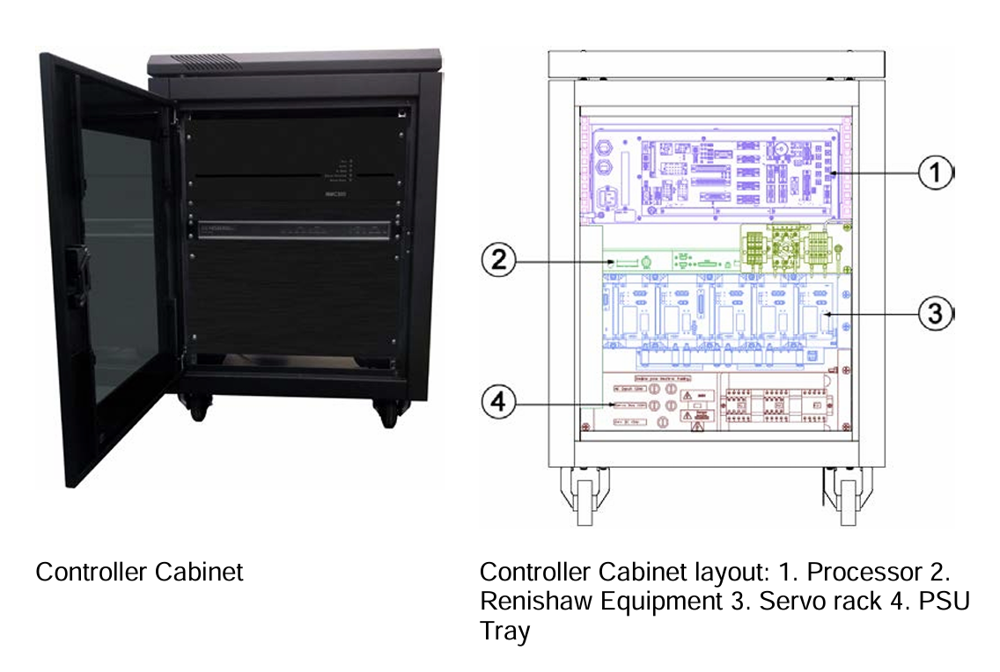

---

### **NMC300(Most Common)**

The NMC300 is the most common and newest controller, it looks like this.

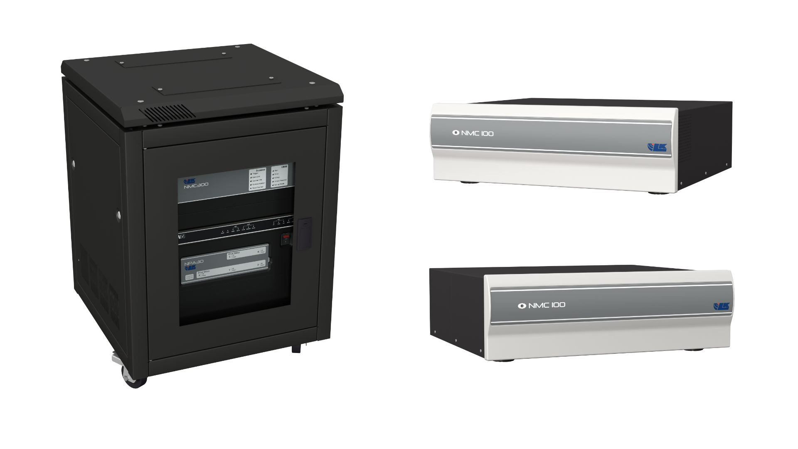

When paired with the NPA30 power supply, the combined unit becomes the NMC330. This is an important note as that is what you should refer to the controller as in your paperwork.

---

### **NPA30**

This is an NPA30, it supplies and regulates the current supplied to the machines motors. It is directly connected to the controller to allow to the controller to adjust the way the current is supplied to the motors. AKA the gains, which can be found in the config file and in Overseer

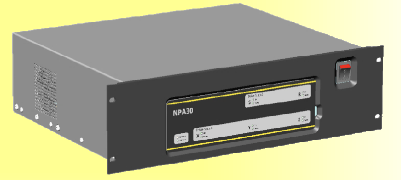

--- 

### **NMC100**

The NMC100 is unique, in that it requires no power rack! So no NPA30, or its older cousin the G7. An important note of this model is that the amplifiers are **INSIDE** the controller. You must lift the top lid, then lift the amplifier rack up and rotate the tongue so that its rests on the ledge allowing you to adjust the pots.

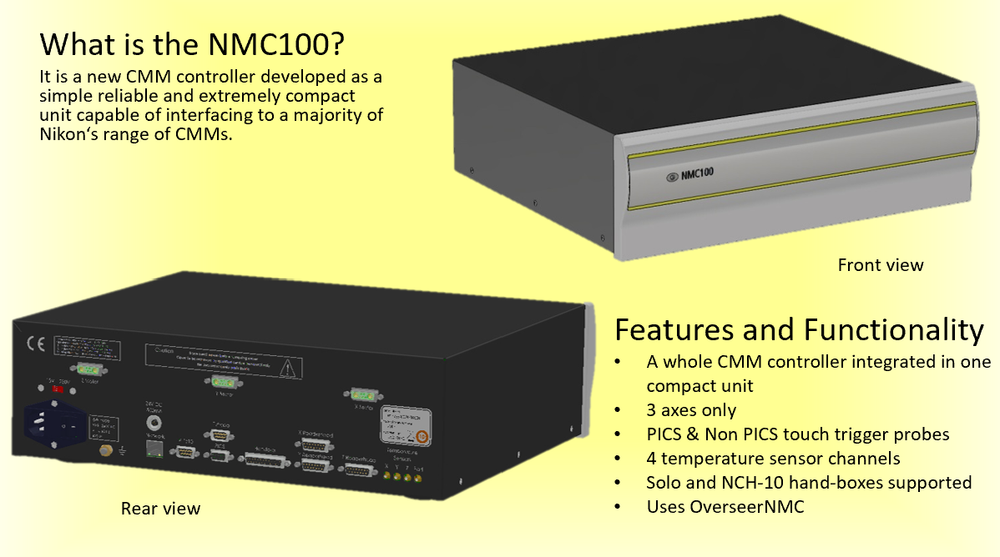

---

### **NMC250**

These are fairly uncommon, that's basically all I have to say

(Only photo I could find..)
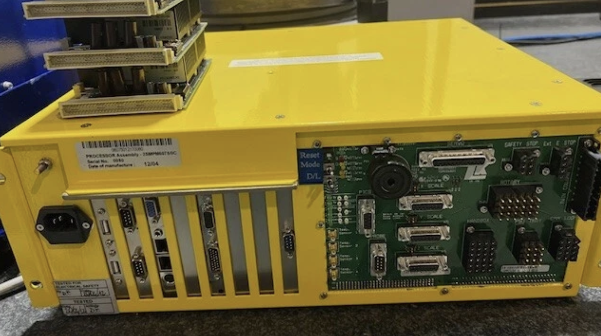

---

### **ACT/AIM**

Weird naming system they got, I know. Anyways these are somewhat common. Notebly, the controller cabinent's are funky and these typically are no longer kept in they're original cabinent. 

Cabinent

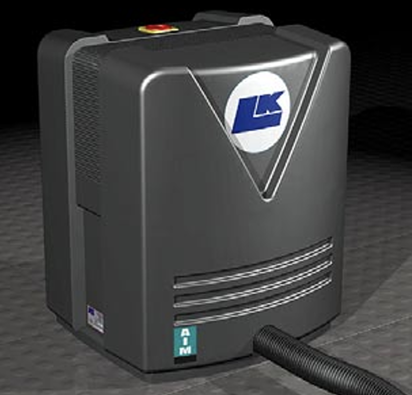

Actual controller (Only image I could find)

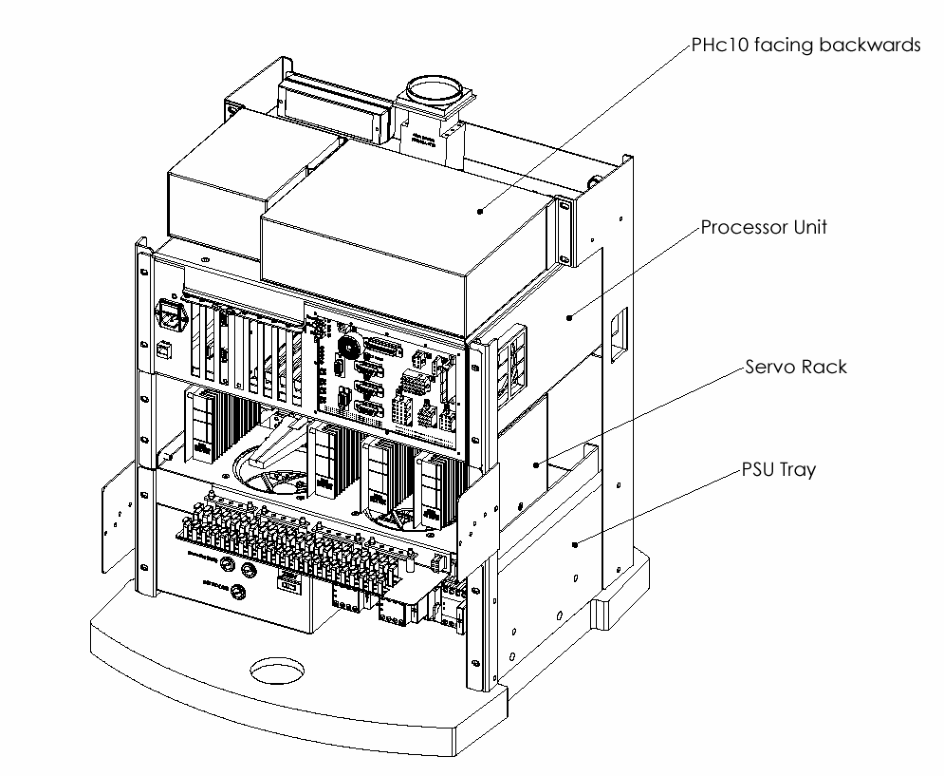

### **LK4000**

Were getting OLD now, I have never personally seen an LK4000. But incase you run into one, heres what it looks like. 

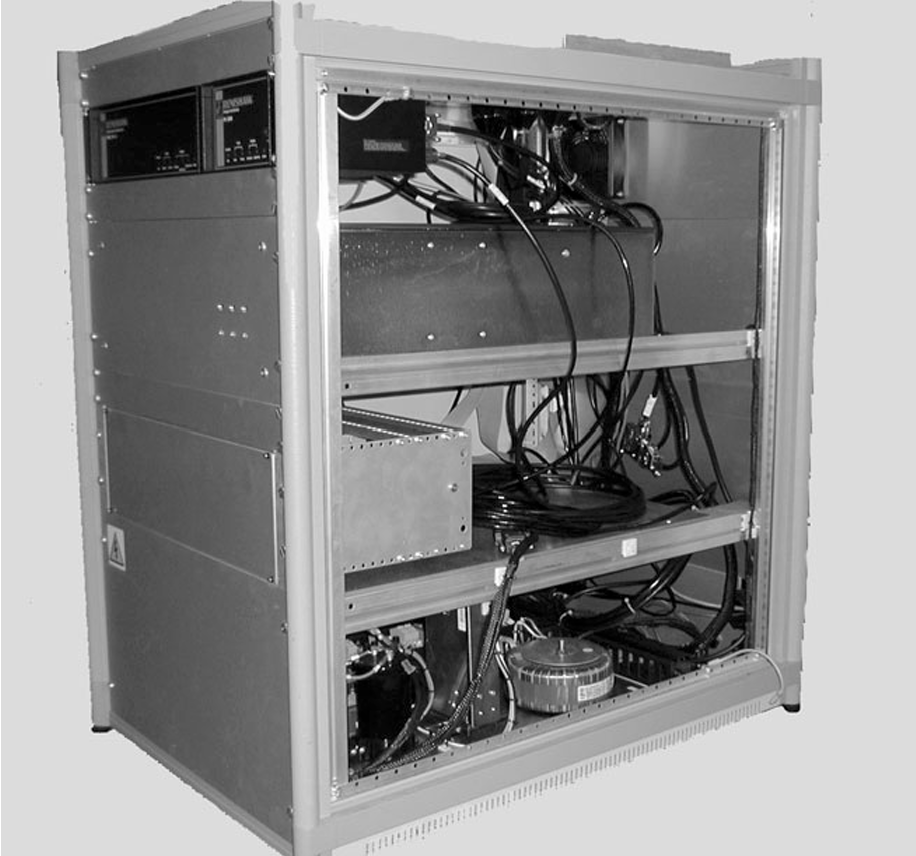

---

### **LK2000**

This is one you may actually come accross on occasion. THEY SUCK. That's all you need to know for now.

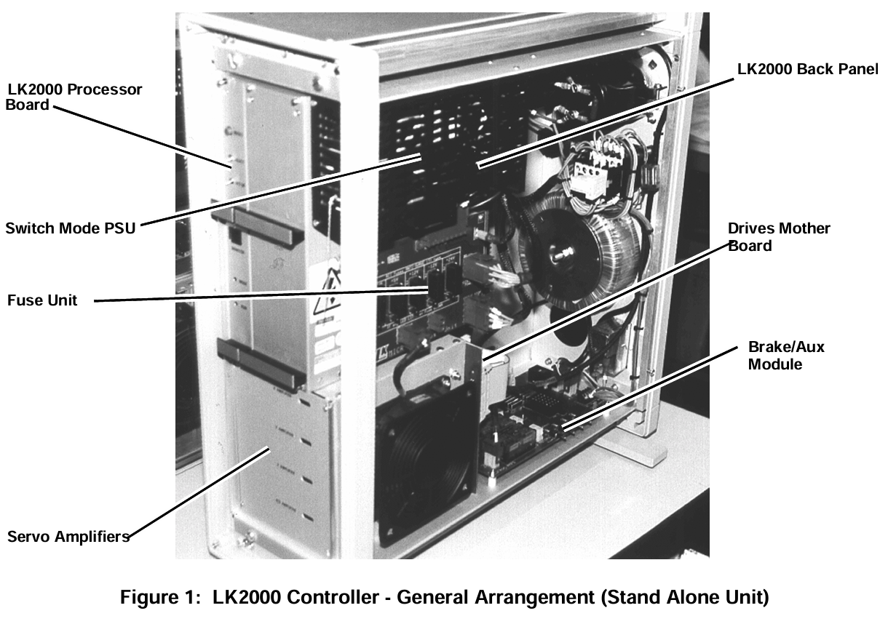

---

### **LK1000**

Never even heard of this one.. 

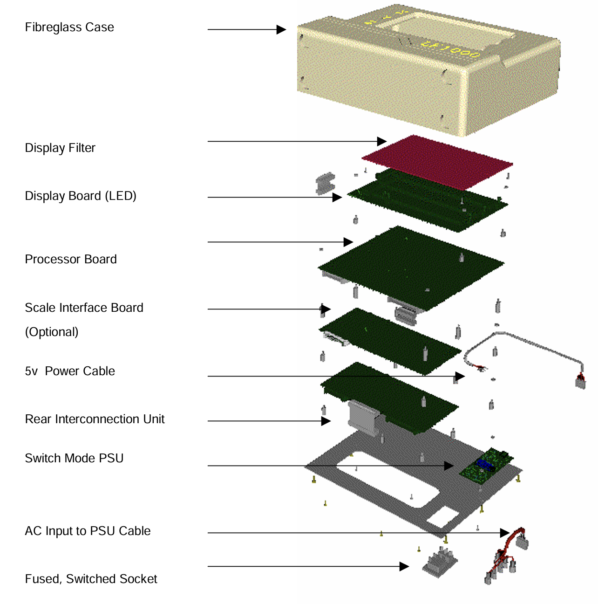

---

## **Hand Box's**

There are about 4 different handbox's I have come accross. All have the same idea, controll 3 axis lol. But understanding what each is called is important

---

### **Solo Handbox**

You've likely seen this one the most.

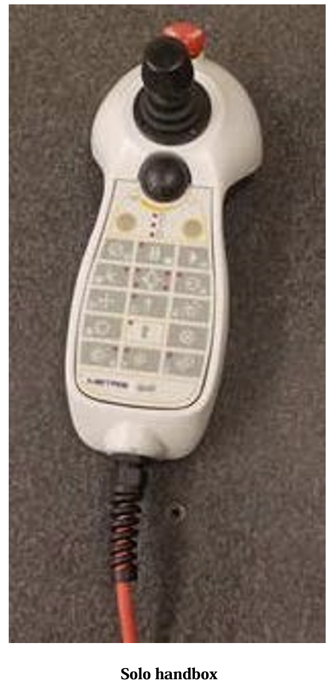

---

### **NCH10**

The older version of the solo handbox

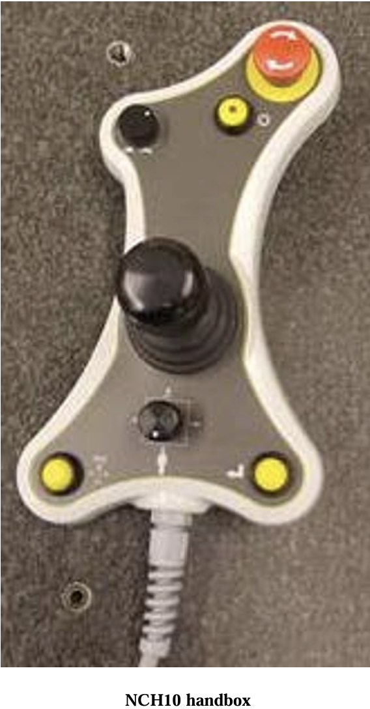

I know these arnt the most flatering photos but im doing what I can with what I got!

---

## **Probe Rack's**

Probe racks are what hold the probe's and assembly's for the CMM which allows it to automatically change tip's during a program!

It's common that you will need to align them. Which means to set them parrallel to the axis they are oriented in. Typically the X axis, to accomplish this you run the align.dmi program and use it to look for deviation in the Y axis from one point to another.

---

### **MCR20**

This is the most common probe rack, and the simpliest!

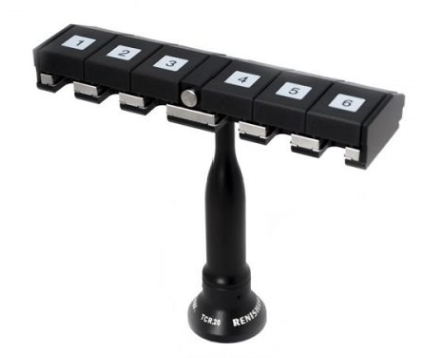

---

### **ACR3**

Second most common, more expensive!! Be careful..

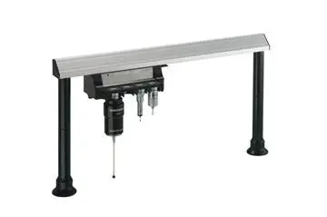

---

