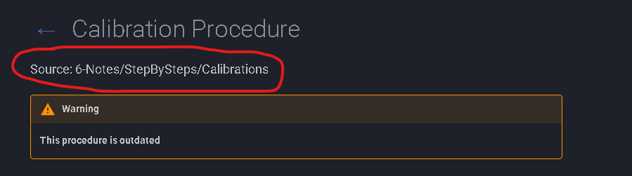

## **Welcome!!**

**This is a short guide on how to best utilize our documentation!**

---

To begin, you should know most of the information under the Documentation tab has
been acquired from the information on **your flash drive** — which can easily be
found by following the file path shown at the top of each document.

{ loading=lazy }

You may want to do this for more context, as the information from each document on
the flash drive has been organized and compiled here.

---

## **So why even use this site?**

Largely, the value of this site is **easily accessible, searchable documentation.**
Say you're struggling to align the laser, or you forgot a step in the calibration
process — instead of digging through the flash drive, just pop over here and search
it up. The information is easier to find and compiled to be more easily digested.

!!! tip "The search bar is your best friend"
    It's at the top of every page and it's instant. Type a keyword like
    *calibration*, *ballbar*, or *squareness* and jump straight to it.

---

## **What's that? — a tour of the tabs**

There's a lot on the site, so here's a quick breakdown of each tab:

- **Documentation** — the core of the site: Hardware, Software, Step By Steps, Procedures, and Important. This is where the troubleshooting and reference material lives.
- **Videos** — training and explainer videos (a few good ones are linked under *Important → Reference Videos*).
- **Simulation** — the CMM error simulator, a visual way to see how geometric machine errors compound across the measuring volume.
- **Random** — self-explanatory: random fun stuff. Found something funny, weird, or just appreciated where you are for the week? Send it over.

---

### Quick-start checklist

- [ ] Try the search bar — type something you do every week
- [ ] Skim **Documentation → Hardware** and **Software**
- [ ] Watch a couple of the **Reference Videos**
- [ ] Bookmark this site so it's one click away

That's it — you're set. If anything's missing or wrong, send it over and it'll get
added.
