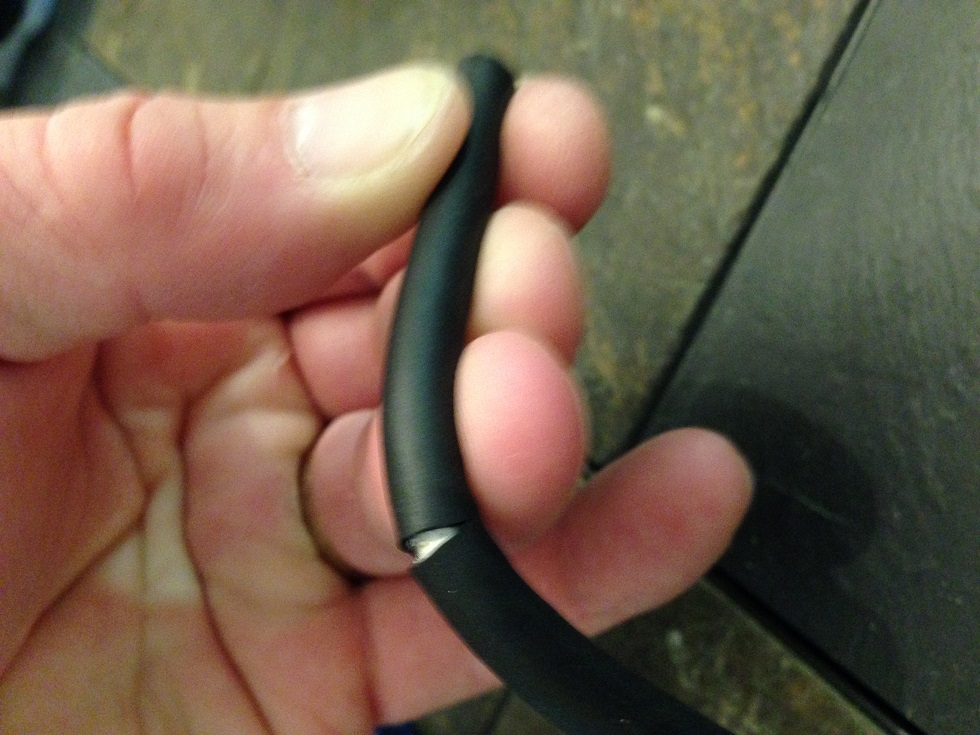
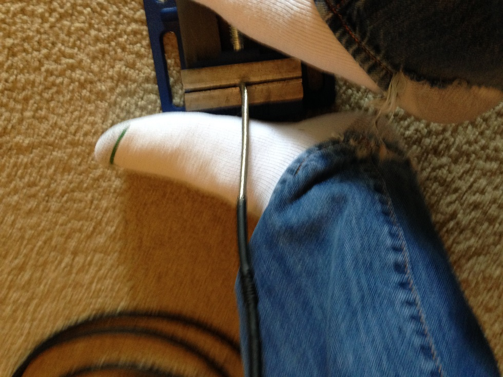
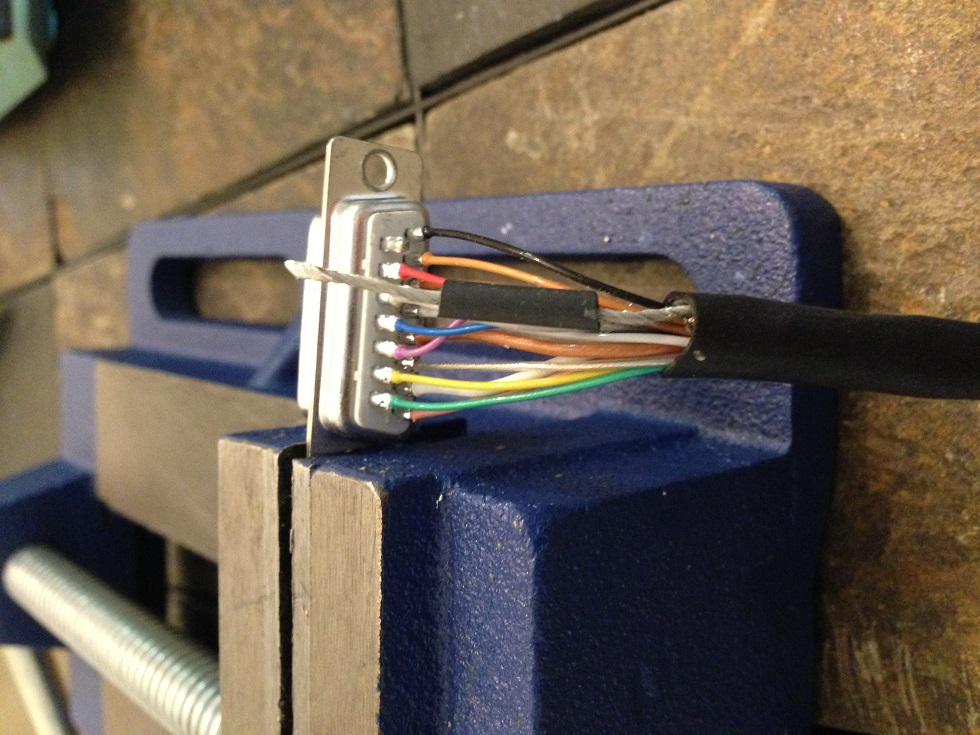
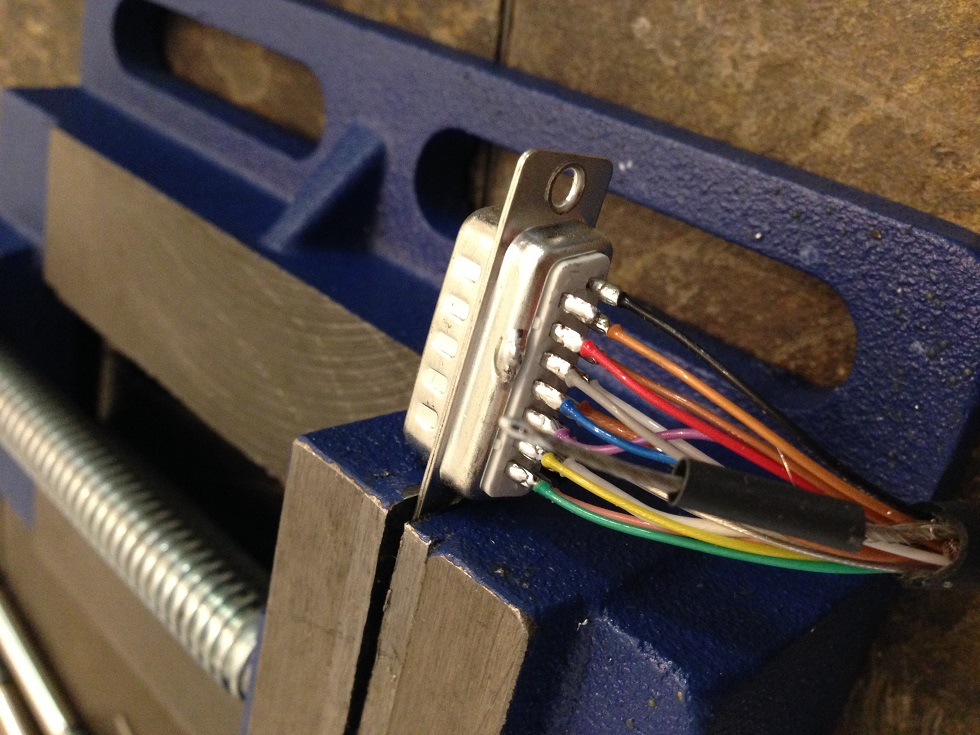
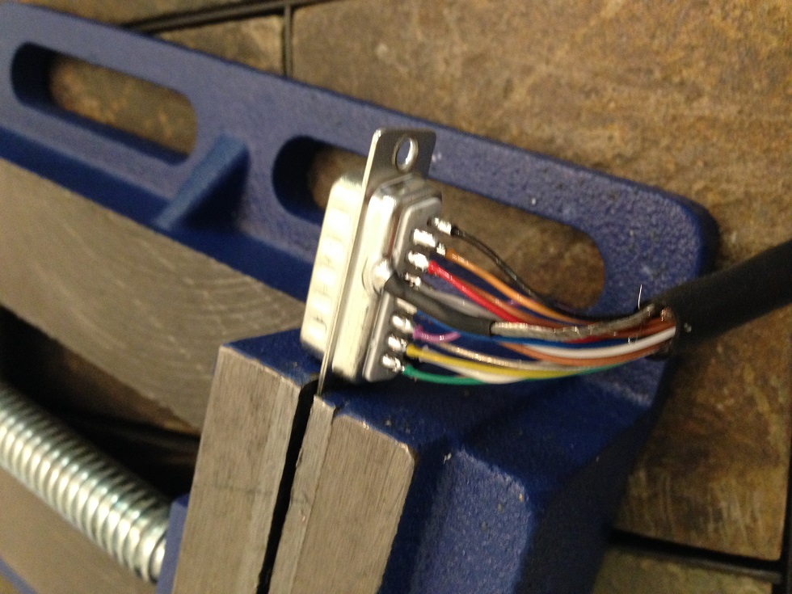

  <a href="javascript:history.back()" class="back-inline" aria-label="Back">←</a>
  <h1>Steve's Soldering Tutorial</h1>

Date: 5/15/16

Translated by Sam 

---

**Step 1:**

 Bend cable at least three fingers deep, then carefully cut the cables coax without damage the internal wires.

---

**Step 2:**

Remove the coax completely.

Note: on newer cable you may find it difficult to remove the coax. Its's recommended that you very carefully cut the remaining coax along the cable to remove.

---

**(optional) Step 3:**

It appears Steve has placed the cable in a vice to pull the coax back further. This is often unnecessary in my experience, but may be helpful for you.

---

**Step 4:**

Carefully bend the grounding shield back over the black coax, then cut the inner coax just as instructed previously. It is also common to cut off the outer grounding shield as it can be inconvenient and is often redundant.

Note:
 Cables vary in structure and you may have no inner coax on your cable

---

**Step 5:**

Steve has now skipped alot of steps, however this gives some idea of how the wires should look.

Be sure to follow the pin out closely and avoid heating the metal pins on the connector for too long as it will melt the plastic housing and ruin the connector.

Also pinch and twist the inner grounding shield as shown in this photo

---

**Step 6:**

Now pull the outer black coax as far up as you can, then place the appropriate shrink wrap over the shielding cable

---

**Step 7:**

Carefully add solder to the top of the connector, the heighth of this solder is very important. Do your best to keep it low profile.

Then tin your grounding wire to prep it for soldering to the connector

---

**Step 8:**

This is a very difficult step, but now you must solder the grounding shield to the top of the connector. Thereby grounding the casing of the connector.

---

**Step 9:**

Put the rest of the housing together around the connector and your good to go!

Good job!