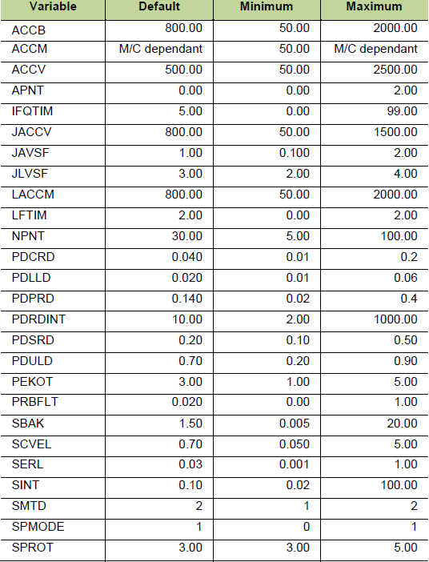
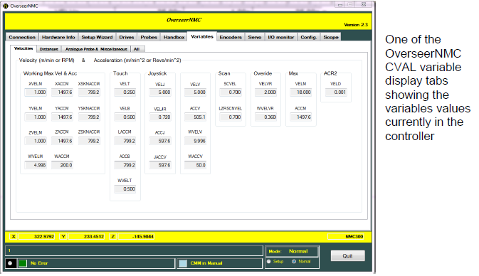
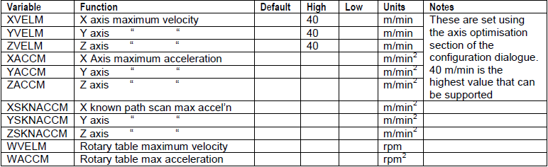
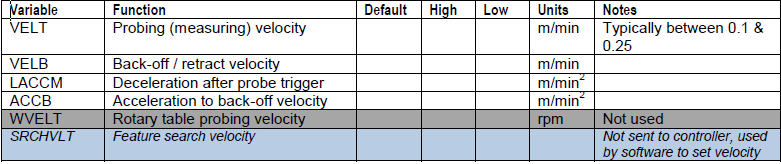
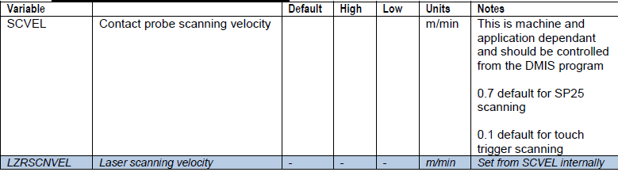
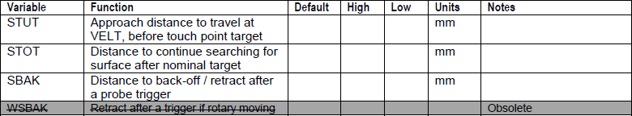
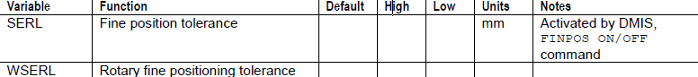
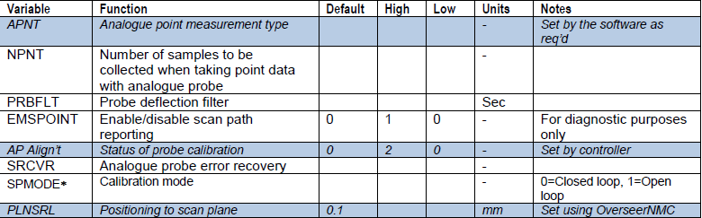
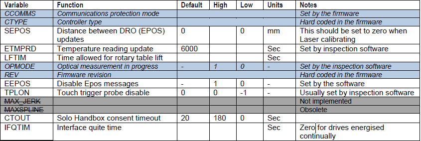
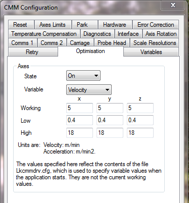

  <a href="javascript:history.back()" class="back-inline" aria-label="Back">←</a>
  <h1>Camio Config</h1>

---

This document provides the user with information about the variables used to control
various aspects of the CMM and controller operation. It provides descriptions of the
variables, and a subset of the variables that should be included in the CMM
configuration file LKcmmdrv.

These variables are often known for historical reasons as CVAL variables, this was the
name used when they were originally introduced on the first controllers.
Some variables have become obsolete and are no longer used on current production
machines but are used on older controllers and so are included here for completeness.

Most of these variables can be set by use of
the CMM Configuration dialogue of CAMIO
which will update the LKcmmdrv.cfg file.
Some of the variables are related to specific
machine characteristics and normally don’t
change but some are measurement
application dependent. These values can be
changed from within a DMIS part program.
The DMIS commands to modify these are
also included in this document.

The setting of the values within the controller
follows the sequence below:

   - Controller starts up and loads
default values for all variables

   - When the inspection software
starts it reads the list of variables and their
values from the configuration file, these
values override the default ones set and
these will be a subset of the entire set of
variables.

   - Some variables may then be changed by the inspection software depending
upon the mode of operation or by commands within a DMIS part program

If the variables are not set then the nominal values within the controller will be used.
Other variables quoted in this document are explained more fully in various Tech
memos the list below states which Tech memos are required to complete this
document.

- UK 539: LK machine standard speeds and accelerations
- UK 777: Installation, integration, configuration and use of the SP25M analogue
probing system
- UK 676: Vecpd
- UK 917: SP25 - Settings and Best Practices

List of variables that should always be included
The following tables give a list of the variable that should be always be included in
most CMM configuration files along with their suggested values for a typical machine
some values may change depending upon the style of machine .

The actual values in operation within the controller can be observed using
OverseerNMC which updates its display as the variables are changed.

( SRCHVLT is not sent to the controller but is used internally by the inspection software.
ACCM should not be set higher than the axis with the lowest acceleration )

The following tables list all the variables grouped by function. A more detailed
description is given later in this document. It is not necessary to include all these
variables in the configuration file. The controller has default values which are adequate
for normal machine operation. Some variables are now obsolete and some are used
internally within the software and firmware. Suggestions for default and high and low
limits are included where appropriate. Where values do not exist, please refer to the
main variable table at the top of this document.

SP25 Settings are also described in detail in UK917.

---

# Velocity & acceleration based variables

**General machine velocities & accelerations**

**Touch Trigger related velocities & accelerations**

**Manual control (hoystick) velocities & accelerations**

**Touch trigger & laser scanning velocities**

**Various other velocities & accelerations**

---
# Distance based variables

**Touch trigger measurment**

**Touch trigger scanning**

**Scale reset / homing**

**Blended moves**

**Positioning**

---
# Analogue probe based variables

**Deflection control**

**Scanning data rate of interval**

**Scanning / measurement control flags**

SPMODE

- CAMIO 6.3, 7.x, 8.0 ( Set default to 0 [closed loop])
- CAMIO 8.1 and above ( Set default to 1 [Open loop])

SPMODE is only available with MCC200/250 and NMC300 Controllers
MCC200 V200.30+
MCC250 V200.31+
NMC300 V300.08+

**Miscellaneous variables**

---

The following section gives a more detailed description of the variables. Some can be changed by
a command in the DMIS part program. Where this is the case then the DMIS code has been
included

i.e. DMIS:: ‘ SET, FEDRAT, POSVEL’

**Axis velocity and acceleration optimisation variables**

XVELM X axis max velocity (m/min^2) DMIS: ‘ SET, FEDRAT, POSVEL’

YVELM Y axis max velocity (m/min^2) DMIS: ‘ SET, FEDRAT, POSVEL’

ZVELM Z axis max velocity (m/min^2) DMIS: ‘ SET, FEDRAT, POSVEL’

XACCM X axis max acceleration (m/min) DMIS: ‘ SET, ACLRAT, POSACL’

YACCM Y axis max acceleration (m/min) DMIS: ‘ SET, ACLRAT, POSACL’

ZACCM Z axis max acceleration (m/min) DMIS: ‘ SET, ACLRAT, POSACL’

These six variables are machine dependent; their values should be taken from relevant machine
specifications document.

They control the velocity and acceleration of all the axes and the controller uses these values to
calculate the ‘Axis optimised values’ for the
machine.

These variables are set using the optimisation tab
of the CMM configuration dialogue.

Different CMM axes can and usually do have
different velocities and accelerations depending
upon the mechanical configuration of the CMM

---

**Variable Descriptions**

**ACCB Back off acceleration after a touch (m/min^2)
**
This is the acceleration used during the retract movement away from the surface after a probe touch. A lower value
helps reduce the jerk that can occur after a touch. If it is too low then the probe can stick to the part, too high and it
can fire the probe off.

---

**ACCM** Maximum acceleration (m/min^2)

This is used for the deceleration after an error or when the handbox pause button or the software ‘Program stop’: icon
has been clicked. The value should be the same as the lowest X, Y, or Z ACCM.

---

**ACCV** Vector acceleration (m/min^2)

Acceleration value used for scale homing sequence only

---

**APNT** Analogue probe measurement method

This is a flag that indicates if the analogue probe is to take a normal measurement point or a special point used during
probe calibration. This must be present in the LKcmmdrv.cfg file even though its value is changed by the inspection
software.

---

**DAVG** Scan data averaging

No longer used.

---

**IFQTIM** Interface quiet time (sec)

This value defines how long the servo drives stay enabled after a move. This is a machine dependent variable. Setting
it to 0 (zero) will leave the amps on all the time and it is often set this way on horizontal arm machines to stop the z
carriage from moving slightly when it is at the extremes of travel.

It is acceptable for the value to be changed for calibration purposes to suit the need of the machine, but after
calibration it must be left to the default of 5 seconds.

Care must be taken when using the zero setting; the E-stop must be used if the machine is left unattended for any
period of time. If the air supply is removed from the machine then the amps will try to drive the machine to hold
position and this will cause the motors to burn out.

---

**JACCV** Joystick acceleration

The 0.3 setting above is the default for all LK2000 controllers, with later controllers this value is 800m/min2

---

**JAVSF** Joystick angular velocity (rpm)

This sets the velocity of the rotary table in joystick mode. The default is set in the firmware and it is not normally
changed, but it can be overridden using this variable.

---

**JLVSF** Joystick linear velocity (m/min)

This value controls the speed of the axis when driven by the handbox joystick. Some users prefer to set it higher on
large machines but care must be taken, because the faster the handbox speed then the more difficult it becomes to
drive the probe around a part without it crashing.

---

**LACCM** Deceleration after a touch (m/min^2)

This is the rate the machine decelerates after a probe trigger. The default is used for all machines and normally
shouldn’t need changing.

---

**LIFTIM** Delay after rotary table lift (sec)

An indexing table requires a period of time to raise the table top before it can start rotating. This value is machine
dependent but a good starting point is 2 seconds. If the customer requires short cycle times then reducing this figure
can help, but caution must be taken. If the delay is too short then the motor will try to rotate the table when it’s still
lifting and its teeth will still be engaged in the coupling and this will create a torque error. The value must be set to 1
second if a continuous table is fitted, as there is still a small delay required for this style of table. If there is no rotary
table fitted then a value of zero is required.

Do not exceed 9 seconds, as this will create a conflict with the COMMS 2 setting in the LKCMMDRV.CFG.

---

**MAXSPLINE** Max number of splines for VCAS command

No longer used.

---

**NPNT** Number of samples used when calibrating an analogue probe

Number of scale and probe readings collected to create a single measurement point when calibrating an analogue
probe

---

**PDAMP** PICS (TP200 & TP7) Probe damping

No longer used.

The PICS probe damping signal was controlled by this variable. Enable damping = -1, Disable damping = 0. This is
now performed automatically by the controller.

---

**PDCRD** Analogue probe calibration reference deflection (mm)

Refer to Tech memo UK917.

---

**PDESD** Probe Deflection Maximum Distance (mm)

No longer used. Last used in 100.10 firmware.

Refer to Tech memo UK777.

---

**PDLLD** Probe Deflection Lower Limit Distance (mm)

Refer to Tech memo UK917.

---

**PDPRD** Probe Deflection Point Reference Distance (mm)

No longer used with AIM, MCC200 and NMC300 controllers
Refer to Tech memo UK917.

---

**PDRDINT** Analogue probe time interval between readings (sec)

When scanning with an analogue probe the data can be collected on a time or position basis, the mode being set by
the SMTD variable. PDRDINT is the time between data points in seconds. E.G. a value of 0.1 would give 10 readings
a second.

Refer to SMTD

---

**PDSRD** Probe Deflection Scan Reference Distance (mm)

DMIS: SCNSET/DRAG,DEFALT,DEFLECTION,0.n

Refer to Tech memo UK777.

---

**PDTD** Analogue probe damping threshold

Started at firmware 100.13

In manual operation the probe deflection must exceed this value to register a manual point.

---

**PDULD** Probe Deflection Upper Limit Distance (mm)

Refer to Tech memo UK917.

---

**PEKOT** Distance to move away from surface before Probe not armed error (mm) (peck scanning).****

Whilst touch trigger scanning the probe has to re-arm after each contact. This is the distance that the probe is allowed
to travel whilst trying to move clear of the surface.

---

**PHSACCV** PHS head rotary accel (deg/sec^2)

The variable is used only when a PHS1 head is fitted.

---

**PHSVELT** PHS head rotary touch velocity (deg/sec)

The variable is used only when a PHS1 head is fitted.

---

**PHSVELV** PHS head rotary velocity (deg/sec)

The variable is used only when a PHS1 head is fitted.

---

**PRBFLT** Analogue probe deflection filter (sec)

This filters the analogue probe deflection values.

---

**PRDIS** Probe disabling for high vibration CMM: 1 = on, 0 = off

Not used on ACT/AIM, MCC200, NMC300 or NMC100 controllers.

This will disable the probe at all times from recording a touch except when the machine moves into touch mode. It is
used on high vibration machines or high velocity moves with long extensions. Care must be taken using this mode as
the machine can crash and the system cannot detect it

---

**SBAK** Back off distance (mm)

DMIS: RETRCT

This is the distance the probe retracts after a probe trigger. If it’s set too low then an illegal touch can occur, too high
and the probe can back off into a nearby object. The value of 1.5mm is the default for all calibration requirements. Any
other setting will take place within the part program, which should return it back to 1.5mm when the program finishes.

---

**SCVEL** Scanning velocity (m/min)

DMIS: SET, FEDRAT, SCNVEL

This sets the speed at which the machine will travel while performing any type of scan. The calibration programs set
the SCVEL at run time which is 0.2 for a digital probe. If the value is reduced then the machine will move more slowly
and more data is taken. The reverse happens if the value is increased.

The low default value is 0.05 and high is 5.

---

**SEPOS** Distance between EPOS messages (mm).

This affects how often the DRO display is updated. For calibration Lasering purposes it must be set to zero otherwise
the true position of the axis will not be displayed. This is the distance a CMM axis move before another EPOS
message (DRO update message) is sent and the DRO is updated. A value of zero means that EPOS messages will
be sent at the maximum rate possible (typically 10 messages per second). Setting a distance will reduce number of
update messages sent lowering the communications overhead and eliminating the DRO flicker when the machine is
stationary.

---

**SERL** Position error limit - positional accuracy after fine positioning command (mm)

This variable sets the positional accuracy tolerance of a machine move after a DMIS FINPOS command. If it’s set too
low then the machine will never get to position. This is really only an issue with older machines and controllers and
setting it to 0.03 is sufficient for all new machines.

---

**SINT** Analogue scanning distance interval (mm)

This is used with an analogue probe to set the distance between scanning points. It is used in conjunction with SMTD.
Refer to SMTD

---

**SMTD** Analogue scanning data collection method

DMIS: ‘SCNSET/DRAG,DIST,n.nn
DMIS: ‘SCNSET/DRAG,Time,n.nn

This defines whether the user wishes to use time based or interval base scanning data collection.

Set via the DMIS part program

Refer to SINT and PDRDINT

---

**SPROT** Distance in contact with the surface when touch probe scanning (mm)

This is used for touch trigger scanning. This controls how far the machine can travel with the probe in contact with the
surface before it triggers an error.

---

**SRCVR** Auto recovery from unknown path scan

Setting this value to 1 will enable unknown path scan error recovery. Should the analogue probe unknown path scan
fail due to a deflection limit violation it will attempt to restart. Setting it to zero switches auto recovery off.

---

**SRLIM** Distance to travel after detecting reference mark (mm)

When homing a machine axis the controller drives the readerhead along at a medium velocity searching for the
reference mark, when it is found it travels past it for a set distance before reversing direction to find it again at a slow
velocity. SRLIM sets this over-travel distance.

---

**SSBAK** Scanning back off distance (mm)

DMIS: ‘ RETRCT’

This determines how far the probe backs off away from the part after it’s completed a scan.

---

**STOT** Over travel distance to detect a touch (mm)

DMIS: ‘SEARCH’

When the machine takes an automatic point it will use 2 variables to determine how far before and after the expected
touch that the probe will become active and register a point.

This value controls the distance the probe will carry on travelling in search of an expected touch. If this value is too
small then a ‘No touch detected’ error may occur. For calibration purposes 10mm is the default.

---

**STUT** Under travel distance to detect a touch (mm)

DMIS: ‘APPRCH’

When the machine takes an automatic point it will use 2 variables to determine how far before and after the expected
touch that the probe will become active and register a point.

This value controls at what distance the probe will start to look before an expected touch. If the value is too small then
the machine does not have enough time to become stable after a high-speed move. This will result in poor
repeatability. For calibration purposes 10mm is the default.

---

**SWPR** Way point Radius (mm)

DMIS: FLY/nn

This will set the size of the radius when waypoint positions are used. It is a user dependent variable and set at
application level.

---

**SXOFF** Distance between S reset magnet and X reset magnet (CMES)

**SXSD** Distance between x and s scales (CMES)

**SYRP** Distance between Y reset and x scale (CMES)

These values are not an LKcmmdrv. cfg configurable variable for Dmis.

Refer to Tech memo UK676.

---

**TPLON** Touch probe de-activated

Touch probe activated (-1= probe not active, 0=probe active)

Warning! This will de-activate the probe and stop it taking points at all times.

---

**TRETRY** Probe rearm retry limit (n)

This is no longer used as it is overridden by the LKcmmdrv. cfg in the ‘RETRY’ tab.

---

**VELB** Back off velocity (m/min)

This value controls the velocity of the retract after a probe trigger. Unless SBAK is set to a large figure then the effect
of this variable is barely noticed. The ACCB variable is more noticeable and has more effect.

---

**VELD** Tool changer docking velocity (Cmes)

This value controls the velocity at which the probe will enter the ACR1 rack. User no longer sets it as all the probe/tip
changer programs set the defaults automatically.

---

**VELM** Maximum velocity (m/min)

This variable is no longer used.

---

**VELT** Touch velocity (m/min)

DMIS: ‘ SET, FEDRAT, MESVEL’

This controls the velocity at which the machine takes a touch. If it’s too high then the machine becomes unstable and
gives poor repeatability and the same result occurs if it’s too low. All current production machines using digital probes
are set to 0.15 but can be set up to 0.25. The lower value of 0.1 is used when analogue probes are fitted
Low is set at 0.1 and High at 0.5. VELT is active between STUT and STOT.

---

**VELV** Vector velocity (m/min)

Set VELV to the same value as the lowest X, Y, or Z VELM. The VELV is used when axis optimisation is switched off.
If it is switched on then older controllers use the axisVELM values to control the vector velocity so VELV should not be
set to the vector velocity as shown in UK539. It is also used for the reset velocity in ‘Variables, Reset’ of the
configurator and a value of 2 is the normal reset speed.

---

**VELVR** Slow speed velocity (m/min)

This controls the velocity of any automatic machine move while the slow speed button is used on the hand box. Slow
speed manual moves on the hand box are controlled by the VELT variable.

---

**WACCM** Rotary max acceleration (rpm^2)

No longer used

---

**WACCV** Rotary acceleration (rpm^2)

DMIS: ‘ SET, ACLRAT, ROTACL’

If a rotary table is fitted then you need to set the acceleration value using this variable. A value of 100 is usually
sufficient for most tables.

---

**WSBAK** Rotary back off (degrees)

This similar to SBAK except it is the rotary table that moves and not the machine.
No longer used.

---

**WSERL**

Positional accuracy after fine positioning command (degrees)

This variable sets the positional accuracy tolerance of a continuous rotary table move after a FINPOS command. If it’s
set too low then the table will never get to position. This is really only an issue with older machines and controllers and
setting it to 0.03 is sufficient for all new machines.

---

**WVELM** Maximum rotary velocity (rpm)

No longer used

---

**WVELT** Used when re-setting the rotary table

The table will travel at the speed when returning to the reference mark.

---

**WVELV** Rotary vector velocity (rpm)

DMIS: ‘ SET, FEDRAT, ROTVEL’

This value sets the rotary table rotational speed. A value of 2 is usually sufficient for most tables. If the value is too low
then cycle times increase but if it’s too high then the part can shift on the table.

---

**WVELVR** Slow rotary velocity

This controls the velocity of any automatic rotary table move while the slow speed button is used on the hand box.

---

**XSKNACCM**

Maximum allowable acceleration in the X axis during known path scanning.

---

**YSKNACCM**

Maximum allowable acceleration in the Y axis during known path scanning.

---

**ZSKNACCM**

Maximum allowable acceleration in the Z axis during known path scanning.

