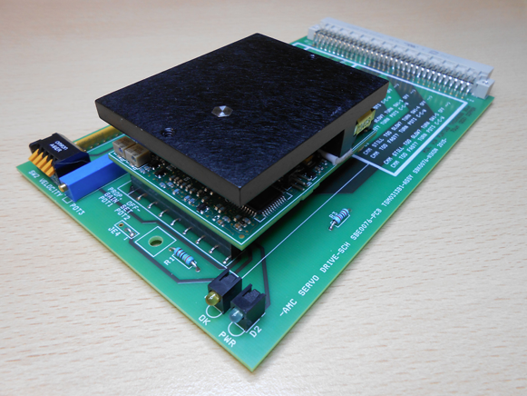
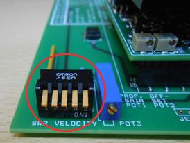
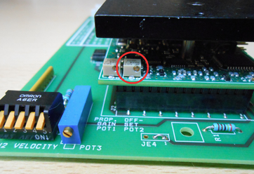
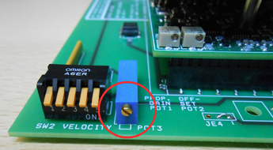
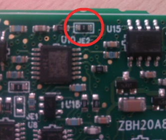
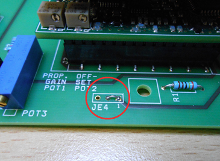
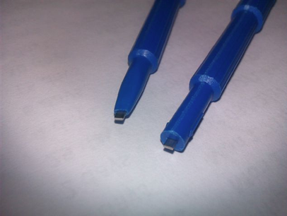

  <a href="javascript:history.back()" class="back-inline" aria-label="Back">←</a>
  <h1>Eurocard Tuning</h1>

Source:
  2-Service CD 7.50/Documentation/Servo Amps

---

## 1. Introduction

The Nikon servo drive SBK0076 is based upon the AMC AZBH20A8-NK1 servo module and is a pin-compatible replacement for the current Axor MS060-08/16 and previously used Control Techniques DCD60x7/14 servo drives. It can be used in any Nikon CMM application in which one of these amplifiers can be used. In is not intended to be used as a replacement for the higher current Axor DCD60x14/28 servo drive as used on the Colossus machines.

For optimal results use an NMC controller (NMC100 with firmware version 309.02 or later or NMC300 with firmware version 300.05 or later) together with OverseerNMC version 2.5 or later. This facilitates the use of a sophisticated FFT (Fast Fourier Transform) tool to tune the proportional gain.

The drive can be used with other controllers, firmware versions and versions of overseer but the FFT optimisation will not be possible. This user guide includes only the NMC/MCC/ACT/AIM controllers but the drive can also be used with the micronDrive/LK2000/LK4000 in much the same way.

---

## 2. Machine wiring

As mentioned above the Nikon servo drive SBK0076 is based upon the AMC AZBH20A8-NK1 servo drive module. This servo drive module operates at a switching frequency of 31KHz which is 55% higher than the Axor drive at 20KHz. This means that management of electrical noise is all the more important when working with the SBK0076 drive.

!!! danger
    Failure to observe these rules could result in CMM instability and consequent loss of measuring performance.

It is absolutely essential that:

- **ALL of the machine cables are properly screened** and that these screens have a low impedance connection to chassis at the controller.  
- Motor and tacho screens need to be terminated at the appropriate grounding bars at the servo rack using **braids, not wires**.  
- In the case of the NMC100 the screens should be properly connected to the connector shells using **360 degree connections and NOT wire tails**.  
- The encoder and probe cables should also be suitably screened and the screens grounded at the connector shells using 360 degree connections.  
- Where the controller is mounted in a cabinet, it and the servo rack must be bonded to the cabinet star point using separate low-impedance connections.  
- The cabinet (or NMC100 enclosure) must be properly earthed.

---

## 3. Controls, indicators and tools

There are several DIP switches, trimpots, jumper links and LEDs on the drive module and carrier board. Below is a description of each.

### SW1 (mode)

4 way DIP switch on the underside of the AMC drive module.  
This is used to configure the drive mode for velocity control.

---

### SW2 (velocity)

5 way DIP switch on the front of the carrier board.  
This is used to scale the tachometer signal to obtain the correct motor speed. It is used during the velocity adjustment phase of commissioning.

---

### POT1 (proportional gain)

Potentiometer on the AMC drive module.  
This is the potentiometer that is nearest to the corner of the drive module PCB. It is used to adjust the velocity loop gain (proportional gain). It is used during the proportional adjustment phase of commissioning.

---

### POT2 (offset)

Potentiometer on the AMC drive module.  
This is the potentiometer that is farthest from the corner of the drive module PCB. It is used to adjust the drive offset (make the motor stand still when there is no demand signal). It is used during the offset adjustment phase of commissioning.

---

### POT3 (velocity)

Potentiometer on the carrier board.  
This is used for fine adjustment of the tachometer scaling in order to set the exact motor speed. It is used during the velocity adjustment phase of commissioning.

---

### JE1 (inhibit/enable)

Zero ohm jumper resistor on the AMC drive module.  
This is used to set the polarity of the inhibit signal. This is pre-set at the factory so should not need to be changed.

---

### JE2 / JE3 (mode)

Zero ohm jumper resistors on the AMC drive module.  
These are pre-set at the factory so should not need to be changed.

JE2

JE3

---

### JE4 (current monitor)

3 pin jumper link on carrier board.  
Pins 1&2 are linked for demanded current and pins 2&3 are linked for actual current. This is pre-set at the factory so should not need to be changed.

---

### LEDs

- **D1 (OK) – yellow LED**  
  Illuminated when the drive is powered, enabled and has no fault condition.

- **D2 (power) – green LED**  
  Illuminated when the 54V DC supply is applied to the drive.

---

## Adjustment tool

The trimpots on the servo drive module (POT1 and POT2) are smaller than those on Axor or Control Techniques drives and cannot be adjusted with the same tool.

For this reason it is essential to use a **Bourns H91 trimpot tool**.

!!! tip
    Modifying the tool as shown improves visibility and engagement and is strongly recommended.

This tool can also be used with the larger POT3.

---

## Access to SW1, JE1, JE2, JE3

As mentioned above, SW1, JE1, JE2 and JE3 are located on the underside of the 
drive module PCB. They are factory set and should not need to be changed. If 
however you wish to check them the drive module must be removed from the carrier 
board. This is done by first removing the black Philips head screw on the underside of 
the carrier board. 

The drive module can then be carefully removed from the carrier board by pulling 
upwards to disengage the connectors. It is important to make sure the drive module 
does not rotate during extraction as this will damage the connectors on the carrier 
board. 

 

---

## 4. Setting-up prior to tuning

### SW1 (mode)

- SW1-1 OFF  
- SW1-2 OFF  
- SW1-3 OFF  
- SW1-4 OFF  

---

### SW2 (velocity)

- SW2-1 ON  
- SW2-2 ON  
- SW2-3 ON  
- SW2-4 ON  
- SW2-5 ON  

---

### POT settings

| Potentiometer | Adjustment |
|--------------|-----------|
| POT1 | Rotate 13 turns anti-clockwise followed by 6.5 turns clockwise |
| POT2 | Rotate 13 turns anti-clockwise followed by 6.5 turns clockwise |
| POT3 | Rotate 16 turns anti-clockwise followed by 8 turns clockwise |

Doing this sets the pots to the center of travel

---

## 5. Tuning procedure (NMC controllers)

### Requirements

- NMC100 controller (firmware 309.02 or higher)  
- or NMC300 controller (firmware 300.05 or higher)  
- OverseerNMC version 2.5 or higher  
- Trimpot tool Bourns H-91  

---

### 5.2. Tuning

The drive is tuned using the OverseerNMC setup wizard. If you have the recommended versions of firmware and OverseerNMC you will be able to optimise the proportional gain using the FFT (Fast Fourier Transform) tool.

!!! warning
    The tuning procedure must be done with care to avoid collisions should the axis move in an unexpected manner.

Note that this guide is not intended to be a comprehensive guide to CMM tuning. It is intended to be a supplement to the existing documentation concentrating mainly on the areas specific to the AMC drive.

If for any reason you do not have the recommended version of firmware or OverseerNMC you can tune the drive without the FFT tool by replacing the step **“Step 6 (second pass)”** with a repetition of the step **“Step 6 (first pass)”**. In either case there should be two proportional adjustments, one before and one after the velocity adjustment:

- Prepare the axis for tuning in the normal way. The wiring should comply with the recommendations given in section 2 above. The motor, tacho and scale must be connected and the air must be on.
- Check that the drive initial settings have been done as described in section 3 above.
- Insert the drive into the servo rack until the DIN41612 connector at the back is fully engaged. Push it in using the carrier board and **NOT** the drive itself. This will prevent damage to the drive mating connectors.
- Launch OverseerNMC and connect to the controller.
- Select the **“setup wizard”** tab – this will put the controller into setup mode.

### Step 1 – Default Values

Choose the correct CMM model including sync or rotary axis as required. Remember to use the **“set”** buttons to download the settings to the controller. If you cannot locate the appropriate CMM type in the drop-down lists please refer to the controller service manual.

Click **“Next”**.

---

### Step 2 – Scales

Check that the appropriate scale resolution and count direction are displayed. If not they can be selected here and the **“set”** button pressed.

Click **“Next”**.

---

### Step 3 – Zero Scales

Click the enable button corresponding to the axis that is to be tuned. Then carefully push the axis until it passes over the scale reset mark. The red indicator will turn green and **“Reset”** will be displayed. The limits of travel are set here also.

If there is no reset mark the scale can be zeroed in an appropriate position using the **“Force reset”** button.

Click **“Next”**.

---

### Step 4 – Motor and Tacho Check

Follow the instructions on the screen to check that the motor and tacho wiring is correct. If so, the axis will move slowly and **“Pass”** will be displayed.

If the wiring is not correct the CMM may move very quickly and **“Fail”** be displayed so be ready to release the consent button.

Once the motor and tacho directions are correct click **“Next”**.

---

### Step 5 – Offset Adjust

Once again follow the instructions on the screen, ensuring that the appropriate axis **“Adjust”** button has been selected. When the handbox consent button is pressed the CMM may move a small amount and the offset reading will move away from zero.

Carefully adjust the drive offset potentiometer **POT2** to bring the offset back to zero.

!!! note
    NOTE that the offset adjustment of the AMC drive is more sensitive than that on the Axor or Control Techniques drives.

When the offset reading is approximately zero it can be tricky to get it to align exactly with the zero mark. A good technique to employ here is to adjust the offset potentiometer a little in the appropriate direction and then release the consent button. Press the consent button again to see what the offset value has become. This pressing and releasing of the consent button is a good means of avoiding the situation where the zero mark is repeatedly overshot.

During this phase check that the axis does not drift onto one of the end stops.

Once the offset is adjusted to zero or as close to zero as possible (a tiny fraction of a turn of error will not be a problem), click **“Next”**.

---

### Step 6 (first pass) – Proportional Adjust (initial coarse adjustment)

Note that in this initial adjustment we will not use the FFT tool.

Click the appropriate **“Adjust”** button to select the axis to be adjusted. Then click the **“Start”** button to move the axis in a cyclic manner.

- If the motor is making an audible noise the proportional potentiometer **POT1** must be turned anti-clockwise until the sound stops and then turned a further half turn anti-clockwise.
- If the motor is silent **POT1** must be turned clockwise until the motor begins to make an audible noise. Then turn **POT1** anti-clockwise until the sound stops followed by an additional half turn anti-clockwise.

When the adjustment is done click **“Stop”**.

Click **“Next”**.

---

### Step 7 – Velocity Adjust

This step must be completed before the proportional gain can be optimised. Follow the on-screen instructions.

Ensure that the start and finish positions will not result in a collision with an end-stop or an obstruction on the CMM table. The start and end positions should be 200mm apart and the axis should travel in a positive direction from start to end.

Then click the **“Start”** button to move the axis in a cyclic manner.

The aim of this step is to adjust the velocity until the meter is reading exactly **100%**.

- If after the drive is first configured the meter is reading more than 100% then the velocity potentiometer **POT3** must be turned anti-clockwise until the meter reads exactly 100%.
- If the meter is reading less than 100% **POT3** must be turned clockwise until the meter reads exactly 100%.
- If the meter is reading less than 100% when **POT3** is fully clockwise **SW2-1** must be opened.
- If required **SW2-2, SW2-3** etc. can be opened in turn until the meter is reading more than 100%, then **POT3** adjusted anti-clockwise.

When the adjustment is done click **“Stop”**.

Click **“Back”**.

---

### Step 6 (second pass) – Proportional Adjust (fine adjustment)

If you do not have the appropriate firmware and version of OverseerNMC, you must repeat the first pass here.

Note that in this fine adjustment phase we will use the FFT tools. For a full description of the FFT tools please refer to technical bulletin **“UK911-A1 FFT Overseer tuning”**.

 the exact data in 
the graphs below will depend on the type of machine and axis being tuned. 
Click the appropriate “Adjust” button to select the axis to be adjusted. Then click 
the “Start” button to move the axis in a cyclic manner. Click the “Expand” button 
to maximise the window and you should see something like this:

The object of this exercise is to **MINIMISE** the largest peak in the frequency response graph by adjusting the proportional pot **POT1**.

Firstly decrease the proportional gain by turning **POT1** counter-clockwise to see if the peak gets larger or smaller. Note that the display only updates every 2 seconds so you may have to wait to see the result of any adjustment.

If the peak gets smaller keep going anti-clockwise to reduce it to a minimum. If you reduce the proportional gain too much, a lower frequency peak will then dominate.

In this case the peaks become **“balanced”** and this is the optimal setting.

Take care when increasing the proportional gain – if the motor begins to squeal then the gain is too high and must be reduced.

If increasing the proportional gain reduces all the peaks right up to the point of oscillation, reduce the gain by turning **POT1** half a turn anti-clockwise. This defines the optimal setting.

---

### Summary of the technique

- At the start, observe the frequency response to see which peak is the largest.
- Adjust **POT1** in the direction that makes this peak smaller.
- When another peak becomes larger, adjust **POT1** until both peaks are the same size (balanced).
- If another peak does not become larger before the motor squeals turn **POT1** half a turn anti-clockwise.

There is **NO NEED** to do an “amp-deriv” test as there is no derivative adjustment to perform.

When completed click **“Next”** and then once again on the step 7 tab.

---

### Step 8 – Auto tuning

Click the appropriate **“Adjust”** button. Ensure that the start and finish positions will not result in a collision with an end-stop or an obstruction on the CMM table.

The start and end positions should be 200mm apart and the axis should travel in a positive direction from start to end.

Click **“Start”**.

If auto-tuning was successful the result will show **“Pass”**. If the result shows **“Fail”** this indicated that one of the previous steps was probably not done correctly, such as setting the count direction or resolution.

Once auto-tuning has passed click **“Finish”**. This will put the controller back into normal mode.

---

## 6. Tuning procedure (ACT / AIM / MCC controllers)

Requirements and tuning steps are identical in structure to the NMC procedure but carried out using **Overseer (NOT OverseerNMC)**.

*(All procedural text preserved verbatim)*

---

## 7. Problem solving

### 7.1 Drive not powered

Likely causes:
- Drive not properly inserted
- Servo contactor not engaging
- Blown 54V fuse

---

### 7.2 Drive not enabled

Likely causes:
- No enable signal
- Drive in error condition

---

### 7.3 Unable to accurately set zero offset

This situation is not unusual with the SBK0076 drive as the adjustment is quite sensitive.

---

### 7.4 Axis drives too slowly

Resolved by re-scaling controller velocity output.

---

### 7.5 Axis drives too quickly

Resolved by re-scaling controller velocity output.

---
